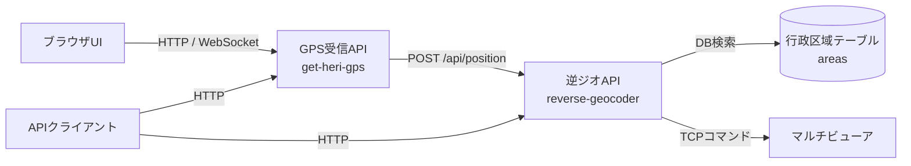
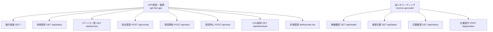

# API索引

## API提供コンテナ

| Service | Base URL | 詳細 |
|---|---|---|
| `get-heri-gps` | `http://<host>:8010` | [api/get-heri-gps.md](api/get-heri-gps.md) |
| `reverse-geocoder` | `http://<host>:8020` | [api/reverse-geocoder.md](api/reverse-geocoder.md) |

`gps-demodulator` はAPIを提供しないため、API詳細ファイルはありません。



呼び出し元から各APIへの関係と、API間の唯一の直接呼出しを示しています。`get-heri-gps` はGPS fix取得後に `reverse-geocoder` の位置APIを同期呼出しします。

## 全API一覧



上段がGPS受信コンテナ、下段が逆ジオコンテナの業務APIです。FastAPIが自動生成する `/docs`、`/redoc`、`/openapi.json` は後続の表に分けています。


### get-heri-gps

| Method | Path | 概要 | 関連WF |
|---|---|---|---|
| GET | `/` | UI HTML | WF-007 |
| GET | `/api/status` | runtime状態 | WF-002、WF-003、WF-007 |
| GET | `/api/devices` | ALSA capture device一覧 | WF-002 |
| POST | `/api/config` | runtime設定変更 | WF-002 |
| POST | `/api/start` | worker開始 | WF-002 |
| POST | `/api/stop` | worker停止要求 | WF-002 |
| GET | `/api/download` | GPS CSV取得 | WF-003 |
| WebSocket | `/ws` | 状態stream | WF-007 |

### reverse-geocoder

| Method | Path | 概要 | 関連WF |
|---|---|---|---|
| GET | `/api/health` | DB状態・件数 | WF-001、WF-005 |
| GET | `/api/latest` | 最新位置 | WF-004 |
| GET | `/api/history` | 直近100件 | WF-004 |
| POST | `/api/position` | 逆ジオ、CSV、MV送信 | WF-004 |

### FastAPI自動エンドポイント

両APIコンテナは `FastAPI(...)` の既定設定を使用するため、次も公開されます。

| Method | Path | 概要 |
|---|---|---|
| GET | `/docs` | Swagger UI |
| GET | `/redoc` | ReDoc |
| GET | `/openapi.json` | OpenAPI 3.1 document |

StaticFilesにより `get-heri-gps` は `/static/*` も配信します。これは業務APIではありません。

## 共通仕様

### Protocol

- HTTP/1.1 plain HTTP
- JSON APIは `application/json`
- `GET /api/download` は `text/csv`
- `/ws` はWebSocket
- アプリ内TLSなし

### 認証

認証・認可はありません。API key、session、JWT、Basic認証は実装されていません。

### CORS

CORS middlewareは設定されていません。同一originの8010 UIは問題ありませんが、別origin browserからの直接API呼出し要件は `TODO: 要確認` です。

### Request model

`POST /api/config` と `POST /api/position` は引数型が `dict` で、Pydanticの個別modelはありません。このためOpenAPI request schemaは `additionalProperties: true` の汎用objectです。

### Response model

明示的response modelはありません。OpenAPIの成功response schemaは空objectです。実際のfieldは各詳細ドキュメントにコード準拠で記載します。

### Error形式

アプリ明示エラー:

```json
{
  "ok": false,
  "error": "message"
}
```

FastAPI validation error例:

```json
{
  "detail": [
    {
      "loc": ["body"],
      "msg": "Field required",
      "type": "missing"
    }
  ]
}
```

未捕捉例外はHTTP 500になり得ます。共通例外handlerはありません。

## Status code概要

| Code | 用途 |
|---|---|
| 200 | 正常、または業務上not found/MV送信失敗をbodyで表現 |
| 400 | 設定変更エラー、`lat/lon` 不正 |
| 404 | 未定義path、存在しないstatic file |
| 422 | body欠落・JSON型不一致等のFastAPI validation error |
| 500 | CSV/DB/FileResponse等の未捕捉例外 |

## OpenAPI上の注意

- `/ws` はOpenAPIに含まれません。
- `/api/download` は実行時CSVですが、response classがOpenAPIへ明示されていないため生成定義上はJSONとして表示されます。
- 独自modelがないため、Swagger UIだけでは実fieldが分かりません。
