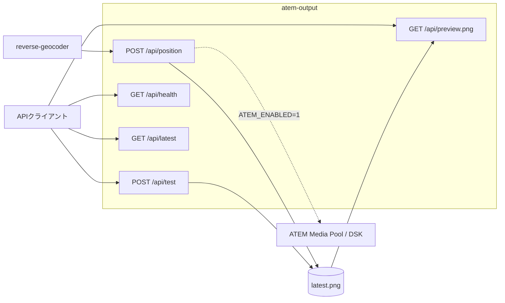

# atem-output API

## 概要

Base URL: `http://<host>:8030`

認証: 全endpointで不要。

実装: `atem_output/app.py`



`POST /api/position` はPNG生成を必ず行い、`ATEM_ENABLED=1` のときだけATEM送信を試行します。

## GET /api/health

| 項目 | 内容 |
|---|---|
| 概要 | サービス状態、ATEM設定、最新状態を返す |
| 認証 | 不要 |
| Request | なし |
| Status | 200 |
| 実装 | `health()` |

## GET /api/latest

| 項目 | 内容 |
|---|---|
| 概要 | 最新のPNG生成・ATEM送信結果を返す |
| 認証 | 不要 |
| Request | なし |
| Status | 200 |
| 実装 | `get_latest()` |

## GET /api/preview.png

| 項目 | 内容 |
|---|---|
| 概要 | 最新PNGを返す。未生成時はテストPNGを生成 |
| 認証 | 不要 |
| Request | なし |
| Status | 200 |
| 実装 | `preview_png()` |

## POST /api/position

| 項目 | 内容 |
|---|---|
| 概要 | 地名付き位置からPNGを生成し、必要ならATEMへ送信する |
| 認証 | 不要 |
| Content-Type | `application/json` |
| Status | 200 |
| 実装 | `post_position()` |

Request例:

```json
{
  "ok": true,
  "address_label": "大阪府大阪市",
  "time": "2026/07/16 23:50:00"
}
```

Response例:

```json
{
  "ok": true,
  "sent": false,
  "skipped": true,
  "reason": "ATEM_ENABLED=0",
  "text": "大阪府大阪市",
  "preview_url": "/api/preview.png"
}
```

## POST /api/test

| 項目 | 内容 |
|---|---|
| 概要 | 任意文字列でPNG生成をテストする |
| 認証 | 不要 |
| Content-Type | `application/json` |
| Status | 200 |
| 実装 | `test_graphic()` |

Request例:

```json
{
  "text": "大阪府大阪市"
}
```
