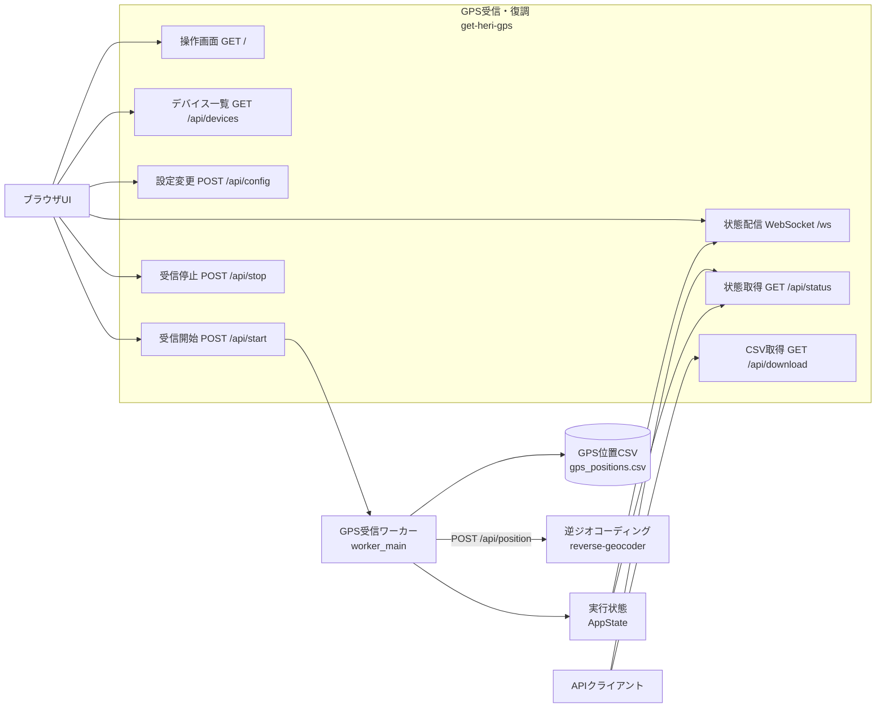

# get-heri-gps API

## 概要

Base URL: `http://<host>:8010`

認証: 全endpointで不要。

実装: `gps_receiver/app.py`



Browser UIは設定・開始停止・状態表示APIを使用し、外部API clientも同じ認証なしendpointへアクセスできます。workerが得たGPS fixはCSVへ保存され、逆ジオAPIへ送られます。

## GET /

| 項目 | 内容 |
|---|---|
| 概要 | 操作用HTMLを返す |
| 認証 | 不要 |
| Request | なし |
| Response | `templates/index.html`、`text/html` |
| Status | 200。template読取失敗時500 |
| 関連WF | WF-007 |
| DB操作 | なし |
| 実装 | `gps_receiver/app.py:index()` |

## GET /api/status

| 項目 | 内容 |
|---|---|
| 概要 | runtime設定、worker状態、最新位置、履歴を返す |
| 認証 | 不要 |
| Request | なし |
| Status | 200 |
| 関連WF | WF-002、WF-003、WF-007 |
| DB操作 | なし |
| 実装 | `status()`、`AppState.snapshot()` |

Response例:

```json
{
  "config": {
    "mode": "command",
    "gps_channel": 2,
    "input_channels": 2,
    "input_device": "hw:2,0",
    "input_command": "arecord -D hw:2,0 -f S16_LE -r 48000 -c 2 -t raw",
    "test_capture_dir": "../audio_capture/20260613_132355",
    "output_csv": "/app/output/gps_positions.csv",
    "reverse_geocoder_url": "http://reverse-geocoder:8020/api/position",
    "window_seconds": 20.0,
    "decode_interval_seconds": 1.0
  },
  "sample_rate": 48000,
  "running": false,
  "started_at": null,
  "status": "stopped",
  "error": "",
  "total_samples": 0,
  "decoded_count": 0,
  "geocode_success_count": 0,
  "geocode_error_count": 0,
  "latest_geocode": null,
  "geocode_error": "",
  "latest": null,
  "recent": []
}
```

`recent` は最大30件です。

## GET /api/devices

| 項目 | 内容 |
|---|---|
| 概要 | `arecord -l` から認識済みcapture deviceを返す |
| 認証 | 不要 |
| Request | なし |
| Status | 200。コマンド失敗時も空配列 |
| 関連WF | WF-002 |
| DB操作 | なし |
| 実装 | `devices()`、`list_capture_devices()` |

Response例:

```json
{
  "devices": [
    {
      "device": "hw:2,0",
      "label": "MS2109 / USB Audio (hw:2,0)",
      "card": 2,
      "subdevice": 0,
      "default_channels": 2
    }
  ]
}
```

`CAPTURE_DEVICE_INCLUDE_KEYWORDS` に一致しないdeviceは除外されます。

## POST /api/config

| 項目 | 内容 |
|---|---|
| 概要 | process内runtime設定を変更する |
| 認証 | 不要 |
| Content-Type | `application/json` |
| Status | 200、400、422 |
| 関連WF | WF-002 |
| DB操作 | なし |
| 実装 | `set_config()`、`AppState.set_config()` |

Request例:

```json
{
  "mode": "command",
  "gps_channel": 2,
  "input_channels": 2,
  "input_device": "hw:2,0",
  "input_command": "arecord -D hw:2,0 -f S16_LE -r 48000 -c 2 -t raw",
  "test_capture_dir": "/app/input/capture",
  "output_csv": "/app/output/gps_positions.csv",
  "reverse_geocoder_url": "http://reverse-geocoder:8020/api/position",
  "window_seconds": 20,
  "decode_interval_seconds": 1
}
```

全field任意です。未知fieldは無視されます。`input_device` 指定時は `input_command` が自動生成されます。

Success:

```json
{
  "ok": true,
  "status": {}
}
```

Error例:

```json
{
  "ok": false,
  "error": "設定を変更するには先に停止してください"
}
```

worker実行中でも、送信値が現在値と同一なら200です。設定はメモリのみで `.env` へ永続化されません。

## POST /api/start

| 項目 | 内容 |
|---|---|
| 概要 | GPS worker threadを開始する |
| 認証 | 不要 |
| Request | body不要 |
| Response | `{"ok":true}` |
| Status | 200 |
| 関連WF | WF-002、WF-003 |
| DB操作 | なし |
| 実装 | `start()`、`worker_main()` |

既に `running` なら何もせず200です。thread内の後続失敗はこのresponseへ反映されません。

## POST /api/stop

| 項目 | 内容 |
|---|---|
| 概要 | workerへstop eventを設定する |
| 認証 | 不要 |
| Request | body不要 |
| Response | `{"ok":true}` |
| Status | 200 |
| 関連WF | WF-002 |
| DB操作 | なし |
| 実装 | `stop()` |

同期joinは行わないため、response時点でworkerが終了済みとは限りません。

## GET /api/download

| 項目 | 内容 |
|---|---|
| 概要 | 現在設定されたGPS CSVを返す |
| 認証 | 不要 |
| Request | なし |
| Response | CSV file、`text/csv` |
| Status | 200。file不存在等は未捕捉500になり得る |
| 関連WF | WF-003 |
| DB操作 | なし |
| 実装 | `download()` |

CSV header:

```text
time,source,channel,offset_sec,lon,lat,alt,group,aircraft,payload_hex
```

## WebSocket /ws

| 項目 | 内容 |
|---|---|
| 概要 | 状態snapshotを0.5秒間隔でpushする |
| 認証 | 不要 |
| Client message | 使用しない |
| Server message | `/api/status` と同じJSON構造 |
| 関連WF | WF-007 |
| DB操作 | なし |
| 実装 | `websocket()` |

WebSocket disconnectは正常終了として処理します。OpenAPIには掲載されません。

## FastAPI自動エンドポイント

| Method | Path | 内容 |
|---|---|---|
| GET | `/docs` | Swagger UI |
| GET | `/redoc` | ReDoc |
| GET | `/openapi.json` | OpenAPI 3.1 |

## Static files

`app.mount("/static", ...)` によりCSS/JSを配信します。認証はありません。

