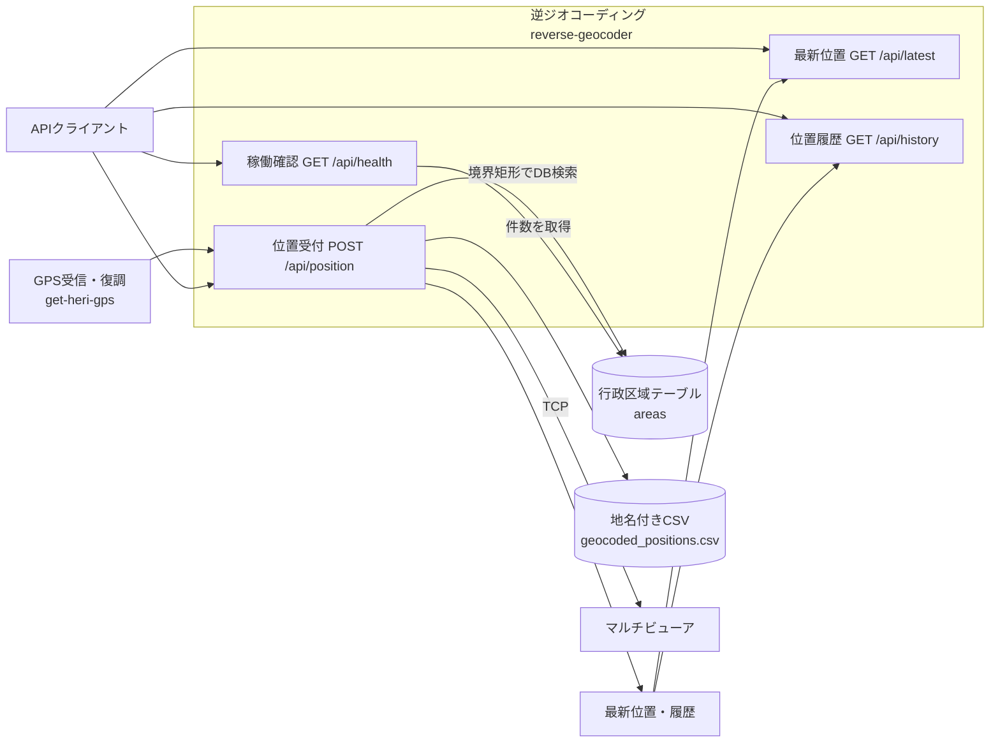

# reverse-geocoder API

## 概要

Base URL: `http://<host>:8020`

認証: 全endpointで不要。

実装: `reverse_geocoder/app.py`



`POST /api/position` は `get-heri-gps` または任意のAPI clientから呼ばれ、DB検索、CSV保存、メモリ更新、MV送信を行います。healthだけが件数をDBから読み、latest/historyはprocess内メモリを返します。

## GET /api/health

| 項目 | 内容 |
|---|---|
| 概要 | DB path存在と `areas` 件数を返す |
| 認証 | 不要 |
| Request | なし |
| Status | 200。DB/schema異常時は500になり得る |
| 関連WF | WF-001、WF-005 |
| DB操作 | `SELECT COUNT(*) FROM areas` |
| 実装 | `health()`、`AdminGeocoder.area_count()` |

Response例:

```json
{
  "ok": true,
  "db_loaded": true,
  "area_count": 7490
}
```

`db_loaded` はpath存在だけを示します。schema健全性そのものの判定ではありません。

## GET /api/latest

| 項目 | 内容 |
|---|---|
| 概要 | process起動後に受信した最新位置を返す |
| 認証 | 不要 |
| Request | なし |
| Status | 200 |
| 関連WF | WF-004 |
| DB操作 | なし |
| 実装 | `get_latest()` |

未受信時:

```json
{
  "ok": false,
  "error": "no position yet"
}
```

受信後は `POST /api/position` responseと同じ構造です。process再起動で消えます。

## GET /api/history

| 項目 | 内容 |
|---|---|
| 概要 | process起動後の直近100件を新しい順で返す |
| 認証 | 不要 |
| Request | なし |
| Status | 200 |
| 関連WF | WF-004 |
| DB操作 | なし |
| 実装 | `get_history()` |

Response:

```json
{
  "items": []
}
```

履歴は `deque(maxlen=100)` で、SQLiteやCSVから復元しません。

## POST /api/position

| 項目 | 内容 |
|---|---|
| 概要 | 緯度経度を地名化し、CSV保存、MV送信を行う |
| 認証 | 不要 |
| Content-Type | `application/json` |
| Status | 200、400、422。未捕捉例外時500 |
| 関連WF | WF-004 |
| DB操作 | `areas` bbox SELECT |
| 実装 | `post_position()`、`AdminGeocoder.reverse()`、`send_position()` |

Request field:

| Field | 必須 | 型 | 内容 |
|---|---|---|---|
| `lat` | 必須 | numberまたはfloat化可能な値 | 緯度 |
| `lon` | 必須 | numberまたはfloat化可能な値 | 経度 |
| `time` | 任意 | any | CSV/APIへそのまま格納。通常は文字列 |
| `alt` | 任意 | any | 高度 |
| `source` | 任意 | any | 送信元識別 |
| `channel` | 任意 | any | 音声channel |

Request例:

```json
{
  "time": "2026/06/21 12:00:00",
  "lat": 34.6937,
  "lon": 135.5023,
  "alt": 100,
  "source": "get_heri_gps",
  "channel": 2
}
```

地名取得・MV送信成功例:

```json
{
  "ok": true,
  "prefecture": "大阪府",
  "city": "大阪市",
  "ward": "北区",
  "address_label": "大阪府大阪市",
  "admin_code": "27127",
  "time": "2026/06/21 12:00:00",
  "lat": 34.6937,
  "lon": 135.5023,
  "alt": 100,
  "source": "get_heri_gps",
  "channel": 2,
  "multiviewer": {
    "enabled": true,
    "sent": true,
    "skipped": false,
    "host": "192.168.11.69",
    "port": 51069,
    "prefix": "STW010V010",
    "text": "大阪府大阪市",
    "response": "OK"
  }
}
```

地名なしはHTTP 200です。

```json
{
  "ok": false,
  "error": "area not found",
  "prefecture": "",
  "city": "",
  "ward": "",
  "address_label": "",
  "admin_code": "",
  "time": "",
  "lat": 0.0,
  "lon": 0.0,
  "alt": "",
  "source": "",
  "channel": "",
  "multiviewer": {
    "enabled": true,
    "sent": false,
    "skipped": true,
    "reason": "empty text"
  }
}
```

`MULTIVIEWER_SEND_ON_NOT_FOUND=0` の場合、実際には `render_text()` が空文字を返すため上記reasonになります。

MV送信例外でもHTTP 200です。

```json
{
  "multiviewer": {
    "enabled": true,
    "sent": false,
    "skipped": false,
    "error": "timed out"
  }
}
```

入力エラー:

```json
{
  "ok": false,
  "error": "lat/lon required"
}
```

これはHTTP 400です。body欠落やobject以外はFastAPIの422です。

### DB操作

```sql
SELECT * FROM areas
WHERE min_lat <= ?
  AND max_lat >= ?
  AND min_lon <= ?
  AND max_lon >= ?;
```

候補行をPythonでpoint-in-polygon判定します。APIからDBへのINSERT/UPDATE/DELETEはありません。

### CSV操作

次へ常に追記します。地名なしでも追記対象です。

```text
/app/output/geocoded_positions.csv
```

```text
time,lon,lat,alt,prefecture,city,ward,address_label,admin_code
```

## FastAPI自動エンドポイント

| Method | Path | 内容 |
|---|---|---|
| GET | `/docs` | Swagger UI |
| GET | `/redoc` | ReDoc |
| GET | `/openapi.json` | OpenAPI 3.1 |

