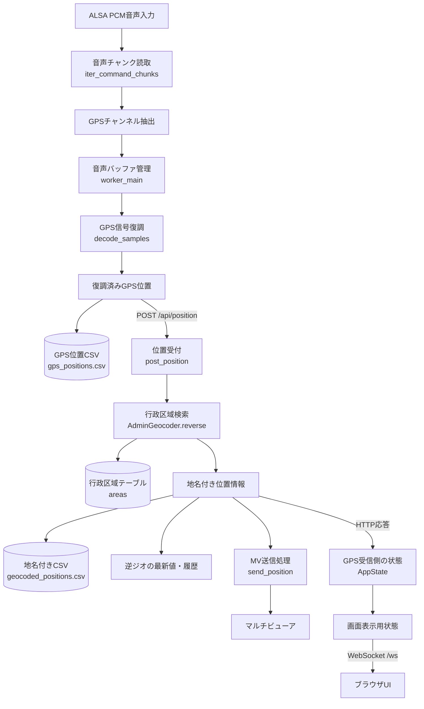

# アーキテクチャ

> 非同期化・再送・障害分離の具体的な改善案は、[非同期連携・再送設計](reliable-pipeline-design.md)を参照してください。設計案は未実装であり、この文書の本文は現行実装を示します。

## 全体構成

```mermaid
flowchart LR
    %% 外部入力・利用者・外部出力（それぞれ独立したブロック）
    subgraph EXT_SDI["GPS信号を含むSDI音声"]
        direction LR
        SDI["SDI音声入力<br/>対象音声チャンネルをUIで指定"]
        CAPTURE["SDI・HDMIキャプチャ機器<br/>AJA・U-TAP・USB Audio等"]
        ALSA["Linux ALSA capture device<br/>/dev/snd・hw:card,device"]
        SDI -->|"映像・音声入力"| CAPTURE
        CAPTURE -->|"PCMへ変換"| ALSA
    end

    subgraph EXT_UI["UI"]
        BROWSER["ブラウザUI<br/>設定・開始停止・状態確認・CSV取得"]
    end

    subgraph EXT_MLIT["国土交通省"]
        MLIT["国土数値情報<br/>N03行政区域ZIP・HTTPS"]
    end

    subgraph EXT_MV["マルチビューアー"]
        MV["外部表示機器<br/>既定 192.168.11.69:51069"]
    end

    %% リアルタイムGPS受信コンテナ
    subgraph GPSC["Docker service: get-heri-gps / gps_receiver"]
        direction LR
        GPSAPI["FastAPI・Uvicorn :8010<br/>gps_receiver/app.py<br/>GET /・/api/status・/api/devices・/api/download<br/>POST /api/config・/api/start・/api/stop<br/>WebSocket /ws"]
        DEVICES["list_capture_devices()<br/>arecord -lを解析<br/>認識中の対象機器をUIへ返す"]
        CONFIG["RuntimeConfig<br/>入力device・入力ch数・GPS ch<br/>20秒window・1秒decode間隔"]
        STATE["AppState・プロセスメモリ<br/>実行状態・最新GPS・最新地名<br/>直近30件・件数・エラー"]
        THREAD["daemon worker thread<br/>worker_main()"]
        INPUT["iter_command_chunks()<br/>arecord subprocess<br/>S16_LE・48kHz・interleaved PCM<br/>0.25秒単位で読取"]
        SELECT["指定GPSチャンネル抽出<br/>signed 16-bit little-endian<br/>単一ch NumPy配列"]
        WINDOW["rolling sample buffer<br/>最大 WINDOW_SECONDS<br/>既定20秒"]

        subgraph DEMOD["gps_demodulator.py / decode_samples()"]
            direction LR
            NORMAL["normalize_samples()<br/>DC除去・振幅正規化"]
            FSK["fsk_bits()<br/>Goertzelで1200Hzと1800Hzを比較<br/>1200 baud・1bit=40 samples"]
            DIFF["diff_bits()・反転<br/>differential decode + invert"]
            HDLC["decode_hdlc_frames()<br/>HDLC flag 0x7e検出<br/>bit stuffing解除・LSB first byte化"]
            CRC["crc16_x25()<br/>CRC residue 0xF0B8を検証<br/>AX.25風 control=0x03・PID=0xF0"]
            MOD["parse_mod_info()<br/>info部 :MODを抽出<br/>BCD・DMSから緯度/経度/高度<br/>group・aircraftも取得"]
            FIX["GpsFix<br/>sample offset・lat・lon・alt<br/>group・aircraft・payload hex"]
            NORMAL --> FSK --> DIFF --> HDLC --> CRC --> MOD --> FIX
        end

        DEDUP["重複除外<br/>offset秒とpayload hex"]
        TIME["時刻計算・日本語表記<br/>開始時刻 + sample offset<br/>YYYY/MM/DD HH:MM:SS"]
        GPSCSV["CsvWriter<br/>/app/output/gps_positions.csv<br/>flush付き追記"]
        GPSLOG["RotatingFileHandler<br/>/app/logs/gps_receiver.log<br/>既定5MB x 本体+5世代"]

        GPSAPI --> DEVICES
        GPSAPI --> CONFIG
        GPSAPI <--> STATE
        GPSAPI -->|"POST /api/start"| THREAD
        CONFIG --> THREAD
        THREAD --> INPUT --> SELECT --> WINDOW --> NORMAL
        FIX --> DEDUP --> TIME --> GPSCSV
        TIME --> STATE
        THREAD -. "処理経過・エラー" .-> GPSLOG
    end

    ALSA -->|"devices mount /dev/snd"| INPUT
    BROWSER -->|"HTTP :8010"| GPSAPI
    GPSAPI -->|"0.5秒ごとに状態JSON"| BROWSER

    %% 逆ジオコーディングコンテナ
    subgraph GEOC["Docker service: reverse-geocoder"]
        direction LR
        GEOAPI["FastAPI・Uvicorn :8020<br/>reverse_geocoder/app.py<br/>GET /api/health・/api/latest・/api/history<br/>POST /api/position"]
        VALIDATE["post_position()<br/>lat・lonをfloatへ変換<br/>不正時 HTTP 400"]
        GEOCODER["AdminGeocoder.reverse()<br/>reverse_geocoder/geocoder.py"]
        BBOX["SQLite bbox候補検索<br/>min/max lat・lon"]
        PIP["point_in_polygon()<br/>even-odd ruleで区域内判定"]
        ADDRESS["逆ジオ結果<br/>都道府県・市区町村・行政区<br/>address_label・admin_code"]
        GEOCSV["append_csv()<br/>/app/output/geocoded_positions.csv"]
        GEOSTATE["プロセスメモリ<br/>latest 1件・history 100件"]
        MVSEND["multiviewer.send_position()<br/>テンプレート展開・同一文字列抑止<br/>既定 STW010V010 + 地名 + CRLF"]
        GEOLOG["RotatingFileHandler<br/>/app/logs/reverse_geocoder.log<br/>既定5MB x 本体+5世代"]
        DB[("/app/data/admin_area.sqlite<br/>areas 7490件 ※確認時点<br/>metadata 3件・bbox index")]

        GEOAPI --> VALIDATE --> GEOCODER --> BBOX
        DB --> BBOX --> PIP --> ADDRESS
        ADDRESS --> GEOCSV
        ADDRESS --> GEOSTATE
        ADDRESS --> MVSEND
        GEOSTATE --> GEOAPI
        VALIDATE -. "受付・結果・エラー" .-> GEOLOG
    end

    TIME -->|"同期HTTP POST<br/>/api/position・JSON・timeout既定3秒"| GEOAPI
    GEOAPI -->|"地名付きJSON応答"| STATE
    MVSEND -->|"TCP・Shift_JIS・CRLF<br/>応答最大1024 bytes・timeout既定2秒"| MV

    %% 行政区域DBの起動時構築
    subgraph IMPORT["reverse-geocoder起動時 / entrypoint.sh・import_admin_areas.py"]
        direction LR
        FRESH["db_is_fresh()<br/>既定30日以内か件数を確認"]
        DOWNLOAD["download()<br/>N03 ZIPを取得"]
        SHAPE["build_db()<br/>ShapefileをUTF-8 / CP932で読取<br/>属性・rings・bboxを抽出"]
        TMPDB["一時SQLiteをDROP / CREATE・全件INSERT<br/>完成後admin_area.sqliteへ置換"]
        FRESH -->|"古い・未作成・強制更新"| DOWNLOAD --> SHAPE --> TMPDB
        FRESH -->|"新しい"| STARTAPI["既存DBを使用"]
    end

    MLIT -->|"HTTPS"| DOWNLOAD
    TMPDB --> DB
    STARTAPI --> DB

    %% ホスト永続領域とDocker運用
    subgraph HOST["ホスト側bind mount・Docker管理"]
        direction LR
        HGPS["./gps_receiver/output<br/>GPS位置CSV"]
        HGEO["./reverse_geocoder/output<br/>地名付きCSV"]
        HDATA["./reverse_geocoder/data<br/>SQLite・取得済みN03 ZIP"]
        HLOG["./gps_receiver/logs<br/>./reverse_geocoder/logs"]
        DLOG["Docker json-fileログ<br/>既定10MB x 3ファイル"]
    end

    GPSCSV --> HGPS
    GEOCSV --> HGEO
    DB --> HDATA
    GPSLOG --> HLOG
    GEOLOG --> HLOG
    GPSC -. "stdout / stderr" .-> DLOG
    GEOC -. "stdout / stderr" .-> DLOG
```



UI、SDI音声、国土交通省、マルチビューアーは、それぞれ独立したブロックで示しています。SDI入力からアプリ内部の処理と出力へ左から右に流れ、実線は主なデータまたは制御、点線はログ出力を表します。

## コンポーネント

| コンポーネント | 種別 | 責務 |
|---|---|---|
| `gps_receiver/app.py` | FastAPI + worker thread | UI/API、ALSA入力、復調制御、CSV、逆ジオ呼出し |
| `gps_receiver/gps_demodulator.py` | domain module | FSK、HDLC、CRC、MOD/BCD解析 |
| `gps_receiver/demodulate_gps.py` | CLI | 保存済みRAWの単発復調 |
| `reverse_geocoder/app.py` | FastAPI | 位置受付、CSV、最新履歴、MV送信制御 |
| `reverse_geocoder/geocoder.py` | domain module | bbox SQLとpoint-in-polygon |
| `reverse_geocoder/import_admin_areas.py` | importer | N03取得、SQLite再構築 |
| `reverse_geocoder/multiviewer.py` | integration | MV向けTCPコマンド送信 |
| `send_multiviewer.py` | host CLI | MVへの手動送信。Composeサービスではない |

## コンテナ間通信

`get-heri-gps` はCompose DNS名 `reverse-geocoder` を使って同期HTTP POSTします。

```text
http://reverse-geocoder:8020/api/position
```

呼出しtimeoutは既定3秒です。キュー、メッセージブローカー、永続retryはありません。

## データの流れ



上から下へ、PCM入力がGPS fixになり、CSV保存・逆ジオ・MV送信・UI表示へ分岐する流れです。逆ジオHTTP呼出しと、その後のDB・CSV・TCP処理は同期実行されます。


1. キャプチャ機器がPCM S16_LE、48kHz、interleaved channelsをALSAへ提供する。
2. `iter_command_chunks()` が0.25秒単位で読み、GPS指定チャンネルを抽出する。
3. `worker_main()` が最大 `WINDOW_SECONDS` のrolling bufferを維持する。
4. `decode_samples()` が1200/1800Hz、HDLC、CRC、`:MOD` を解析する。
5. GPS fixを `gps_positions.csv` へ追記する。
6. 同じ処理スレッドで `POST /api/position` を同期実行する。
7. `AdminGeocoder.reverse()` がSQLiteをbbox検索し、候補をpoint-in-polygon判定する。
8. 地名付き結果をCSVとメモリに保存する。
9. `send_position()` がMVへTCP送信する。
10. GPS側UIへWebSocketで最新状態を0.5秒間隔送信する。

## 同期・非同期

| 処理 | モデル |
|---|---|
| GPS音声処理 | daemon `threading.Thread` 1本 |
| 音声chunk読取 | worker内同期I/O |
| 復調 | worker内同期CPU処理 |
| 逆ジオHTTP | worker内同期HTTP |
| WebSocket送信 | FastAPI event loop上のasync loop |
| 逆ジオAPI handler | `async def` だがDB、CSV、TCPは同期処理 |
| MV送信 | API request内同期TCP |
| DB更新 | コンテナ起動時の同期バッチ |

逆ジオの同期DB/TCP処理はevent loopをブロックする可能性があります。想定同時接続数と性能要件は `TODO: 要確認` です。

## 状態管理

### get-heri-gps

`AppState` がプロセスメモリに以下を保持します。

- 実行状態、エラー、開始時刻
- 総sample数、復調件数、逆ジオ成否件数
- 最新GPS、最新地名、直近30件
- worker threadとstop event

再起動すると状態は消えます。CSVはbind mountに残ります。

### reverse-geocoder

- `latest`: 最新1件
- `history`: `deque(maxlen=100)`
- `_last_text`: MV重複抑止用の直前文字列

いずれもプロセスメモリで、再起動時に消えます。

## 外部連携

### 国土数値情報

起動時にN03 ZIPをHTTPS取得し、ShapefileからSQLiteを作ります。DBが更新日数内なら再取得しません。取得失敗時は既存DBを使用し、DBが存在しなければ空DBを作ります。

### Multiviewer

既定では次をShift_JISで送ります。

```text
STW010V010{address_label}\r\n
```

応答は最大1024 bytes読みます。送信エラーはAPI全体を失敗させず、レスポンス内 `multiviewer.error` に格納します。

## 認証・認可

- API認証: なし
- WebSocket認証: なし
- ロール/権限: なし
- TLS終端: アプリ内にはなし
- CORS middleware: なし
- request rate limit: なし

公開ポートへ到達できるクライアントは、入力設定変更、worker開始停止、位置POSTが可能です。ネットワークACL、reverse proxy、認証導入の要否は `TODO: 要確認` です。

## 永続化

| データ | 方式 | 永続化先 |
|---|---|---|
| GPS fix | CSV append | `/app/output/gps_positions.csv` |
| 地名付き位置 | CSV append | `/app/output/geocoded_positions.csv` |
| 行政区域 | SQLite | `/app/data/admin_area.sqlite` |
| アプリログ | rotating file | `/app/logs/*.log` |
| Docker標準ログ | json-file | Docker管理領域、10MB x 3 |

CSVはDBテーブルではありません。GPS履歴・地名履歴をDBへ保存する実装はありません。

## 実装上の境界

- ORM、repository、controller classはなく、FastAPI route functionがhandler/controller相当です。
- Pydantic request/response modelは未定義で、OpenAPI schemaは汎用objectです。
- DB migration frameworkはなく、importerがテーブルをDROP/CREATEします。
- test codeはリポジトリ内にありません。
