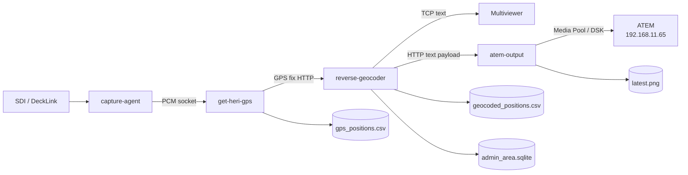

# アーキテクチャ

## 全体構成


```mermaid
flowchart LR
    SDI["SDI / DeckLink"] --> CA["capture-agent"]
    CA -->|"PCM socket"| GPS["get-heri-gps"]
    GPS -->|"GPS fix HTTP"| GEO["reverse-geocoder"]
    GEO -->|"TCP text"| MV["Multiviewer"]
    GEO -->|"HTTP text payload"| ATEMOUT["atem-output"]
    ATEMOUT -->|"Media Pool / DSK"| ATEM["ATEM<br/>192.168.11.65"]

    GPS --> GPSCSV[("gps_positions.csv")]
    GEO --> GEOCSV[("geocoded_positions.csv")]
    GEO --> DB[("admin_area.sqlite")]
    ATEMOUT --> PNG[("latest.png")]
```

## コンテナの役割

| Service | Port | 役割 |
|---|---:|---|
| `get-heri-gps` | 8010 / 9010 | PCM受信、GPS復調、GPS CSV、UI/API |
| `reverse-geocoder` | 8020 | 緯度経度を住所化、撮影位置計算、MV/ATEMへ出力 |
| `atem-output` | 8030 | ATEM用PNG生成、ATEM Media Pool/DSK制御 |
| `capture-agent` | ホスト側 | DeckLink/SDIからPCMを取得して `get-heri-gps` へ送る |

## スレッド構成


```mermaid
flowchart LR
    subgraph CA["capture-agent"]
        CA_MAIN["main / control API"]
        CA_PROC["capture process<br/>gst-launch / DeckLink"]
        CA_ERR["stderr reader thread"]
    end

    subgraph GPS["get-heri-gps"]
        GPS_API["FastAPI / uvicorn<br/>UI・API・WebSocket"]
        GPS_WORKER["GPS worker thread<br/>PCM受信・GPS復調・CSV保存"]
        GPS_GEOCODE["geocode sender thread<br/>reverse-geocoderへPOST"]
    end

    subgraph GEO["reverse-geocoder"]
        GEO_API["FastAPI / uvicorn<br/>逆ジオAPI"]
        GEO_OUTPUT["output_worker thread<br/>MV / ATEMOUTPUTへ送信"]
    end

    subgraph ATEMOUT["atem-output"]
        ATEM_API["FastAPI / uvicorn<br/>PNG生成・ジョブ投入"]
        ATEM_WORKER["atem-upload-worker thread<br/>ATEMへPNG送信"]
        ATEM_LOCK["ATEM_CLIENT.lock<br/>同時送信防止"]
    end

    CA_MAIN --> CA_PROC
    CA_PROC --> CA_ERR
    CA_PROC -->|"PCM socket"| GPS_WORKER
    GPS_API -->|"start/stop/status"| GPS_WORKER
    GPS_WORKER -->|"latest only queue"| GPS_GEOCODE
    GPS_GEOCODE -->|"POST /api/position"| GEO_API
    GEO_API -->|"output_queue"| GEO_OUTPUT
    GEO_OUTPUT -->|"TCP"| MV["Multiviewer"]
    GEO_OUTPUT -->|"POST /api/position"| ATEM_API
    ATEM_API -->|"latest upload job"| ATEM_WORKER
    ATEM_WORKER --> ATEM_LOCK
    ATEM_LOCK -->|"pyatem"| ATEM["ATEM"]
```

`thread` と書いてある箱が、明示的に作っている専用スレッドです。  
縦や横の位置はスレッド数ではなく、処理の流れを見やすく並べたものです。

## リアルタイム優先の考え方

古い地名や古いPNGを後から順番に表示しないため、各queueは基本的に最新優先です。

```text
新しい位置が来る
↓
未処理の古い位置・古いATEM送信ジョブは捨てる
↓
最新だけ処理する
```

ATEM送信はMedia Poolアップロードが重いため、HTTP APIとは別の `atem-upload-worker thread` で送ります。

