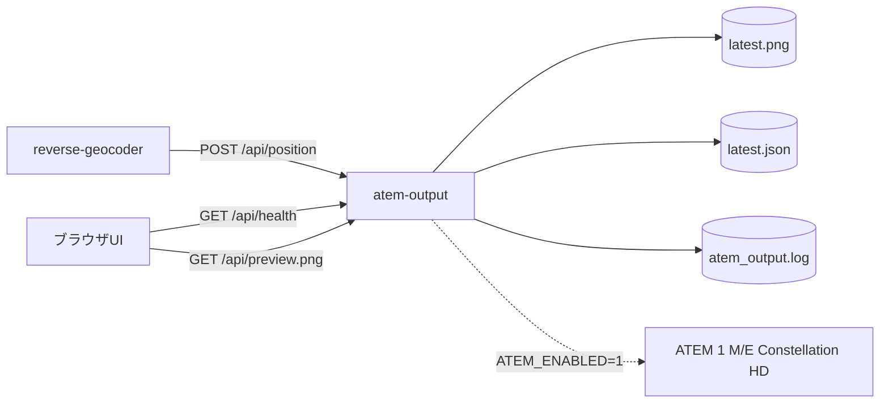

# atem-output

## Service情報

| 項目 | 値 |
|---|---|
| Compose service | `atem-output` |
| Container name | `atem_output` |
| Build context | `./atem_output` |
| Dockerfile | `atem_output/Dockerfile` |
| Image base | `python:3.12-slim` |
| Restart | `unless-stopped` |

## 役割

- 逆ジオ結果からATEM用PNGを生成する
- 最新PNGを `/api/preview.png` として配信する
- 実機有効時にATEM Media PoolへPNGをアップロードする
- Media PlayerとDownstream Keyerを制御する

## 入出力・依存関係図



`ATEM_ENABLED=0` の場合はPNG生成とプレビューのみ行います。実機接続後に `ATEM_ENABLED=1` と `ATEM_HOST` を設定すると、Media PoolアップロードとDSK制御を試行します。

## 入力

| 入力 | 形式 | 取得元 |
|---|---|---|
| 地名付き位置 | JSON | `reverse-geocoder` |
| テスト文字列 | JSON | `POST /api/test` |

## 出力

| 出力 | 保存/送信先 |
|---|---|
| 最新PNG | `/app/output/latest.png` |
| 最新状態JSON | `/app/output/latest.json` |
| Preview API | port 8030 |
| ATEM制御 | `ATEM_HOST` |
| ログ | `/app/logs/atem_output.log` |

## 環境変数

| 変数 | 既定例 | 内容 |
|---|---|---|
| `PORT` | `8030` | API port |
| `IMAGE_WIDTH` | `1920` | PNG幅 |
| `IMAGE_HEIGHT` | `1080` | PNG高さ |
| `TEXT_TEMPLATE` | `{address_label}` | 表示文字列template |
| `FONT_PATH` | NotoSansCJK | 日本語フォント |
| `FONT_SIZE` | `72` | 最大フォントサイズ |
| `POSITION_X` / `POSITION_Y` | `96` / `820` | テロップ左上位置 |
| `POSITION_ANCHOR` | `top_left` | `top_left` または `top_right` |
| `TEXT_ALIGN` | `left` | `left` または `right` |
| `BOX_COLOR` | `0,0,0,180` | 背景マット色RGBA |
| `MATTE_ENABLED` | `1` | 背景マット描画の有効/無効 |
| `TEXT_COLOR` | `255,255,255,255` | 文字色RGBA |
| `ATEM_ENABLED` | `0` | ATEM実機送信有効化 |
| `ATEM_HOST` | 空 | ATEM IPアドレス |
| `ATEM_MEDIA_POOL_SLOT` | `1` | still slot、1始まり |
| `ATEM_MEDIA_PLAYER` | `1` | Media Player、1始まり |
| `ATEM_DSK` | `1` | Downstream Keyer、1始まり |
| `ATEM_FILL_SOURCE` | `3010` | Media Player 1 Fill想定 |
| `ATEM_KEY_SOURCE` | `3011` | Media Player 1 Key想定 |

## 関連API

- [atem-output API](../api/atem-output.md)

## ログ確認

```bash
docker compose logs -f atem-output
tail -f atem_output/logs/atem_output.log
```

## コンテナに入る

```bash
docker compose exec atem-output sh
```

## 実機設置後の最小設定

`atem_output/.env` を編集します。

```env
ATEM_ENABLED=1
ATEM_HOST=192.168.11.xxx
ATEM_MEDIA_POOL_SLOT=1
ATEM_MEDIA_PLAYER=1
ATEM_DSK=1
```

その後、再起動します。

```bash
docker compose up -d --build atem-output
```
