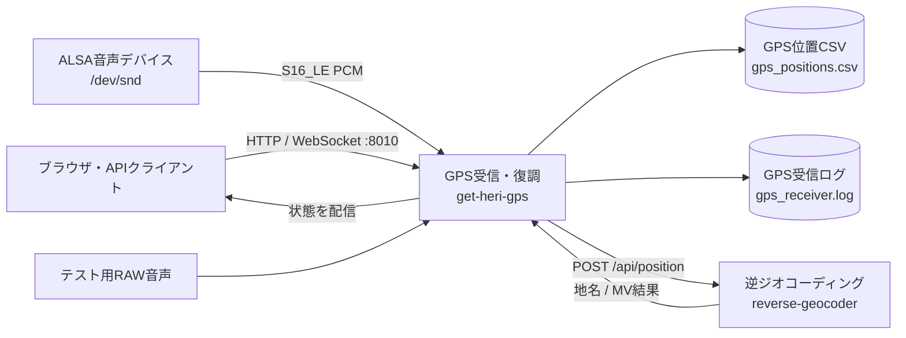

# get-heri-gps

## Service情報

| 項目 | 値 |
|---|---|
| Compose service | `get-heri-gps` |
| Container name | `get_heri_gps` |
| Build context | `./gps_receiver` |
| Dockerfile | `gps_receiver/Dockerfile` |
| Image base | `python:3.12-slim` |
| Command | `python app.py` |
| Restart | `unless-stopped` |

## 入出力・依存関係図



左側が入力、中央が対象コンテナ、右側が出力と依存先です。`reverse-geocoder` が失敗してもGPS CSVへの保存は継続します。

## 役割

- ALSA capture device一覧をUIへ提供する
- 指定音声channelからGPS/MODをリアルタイム復調する
- GPS CSVを追記する
- `reverse-geocoder` へ位置をPOSTする
- 最新位置、地名、MV送信結果をUI/WebSocketへ配信する

## 入力

| 入力 | 形式 | 取得元 |
|---|---|---|
| 音声 | S16_LE、48kHz、interleaved PCM | `/dev/snd` + `arecord` |
| runtime設定 | JSON | `POST /api/config` |
| start/stop | HTTP | UI/API |
| test raw | single-channel `.raw` | `TEST_CAPTURE_DIR`。UIは通常 `command` mode固定 |

## 出力

| 出力 | 保存/送信先 |
|---|---|
| GPS CSV | `/app/output/gps_positions.csv` |
| 位置JSON | `reverse-geocoder /api/position` |
| UI HTML/CSS/JS | port 8010 |
| 状態stream | `/ws` |
| ログ | `/app/logs/gps_receiver.log`、stdout/stderr |

## 依存関係

| 依存 | 必須度 | 備考 |
|---|---|---|
| ALSA `/dev/snd` | 実機取得時必須 | Compose device mapping |
| `arecord` | 必須 | Dockerfileで `alsa-utils` をinstall |
| `reverse-geocoder` | 地名/MVに必要 | GPS CSVは依存先失敗時も保存 |
| Browser | 任意 | UI操作用。APIのみでも操作可能 |

Compose `depends_on` はありません。

## Port

| Host | Container | Protocol | 用途 |
|---|---|---|---|
| `GPS_RECEIVER_PORT`、既定8010 | `PORT`、既定8010 | TCP HTTP/WS | UI/API/WebSocket |

## Volume・device

| Host | Container | Mode | 用途 |
|---|---|---|---|
| `HOST_GPS_OUTPUT_DIR` | `/app/output` | rw | CSV |
| `HOST_GPS_LOG_DIR` | `/app/logs` | rw | rotating log |
| `/dev/snd` | `/dev/snd` | rwm | 音声device |

追加グループ `audio` で起動します。

## 環境変数

### Server・入力

| 変数 | 既定例 | 内容 |
|---|---|---|
| `HOST` | `0.0.0.0` | bind address |
| `PORT` | `8010` | bind port |
| `SAMPLE_RATE` | `48000` | sample rate |
| `INPUT_DEVICE` | `hw:2,0` | ALSA device |
| `INPUT_CHANNELS` | `2` | 総channel数 |
| `GPS_CHANNEL` | `2` | GPS channel、1始まり |
| `INPUT_COMMAND` | 自動生成 | stdoutへPCMを出すcommand |
| `CAPTURE_DEVICE_INCLUDE_KEYWORDS` | `AJA,...` | device表示filter |

### 復調・出力

| 変数 | 既定例 | 内容 |
|---|---|---|
| `GPS_BAUD` | `1200` | baud |
| `GPS_MARK_HZ` | `1200` | mark |
| `GPS_SPACE_HZ` | `1800` | space |
| `WINDOW_SECONDS` | `20.0` | rolling buffer |
| `DECODE_INTERVAL_SECONDS` | `1.0` | decode interval |
| `OUTPUT_CSV` | `/app/output/gps_positions.csv` | CSV path |
| `TEST_CAPTURE_DIR` | `../audio_capture/...` | test mode input |

### サービス連携・ログ

| 変数 | 既定例 | 内容 |
|---|---|---|
| `REVERSE_GEOCODER_URL` | `http://reverse-geocoder:8020/api/position` | 地名API |
| `REVERSE_GEOCODER_TIMEOUT_SECONDS` | `3.0` | HTTP timeout |
| `LOG_DIR` | `/app/logs` | log dir |
| `LOG_FILE` | `gps_receiver.log` | file name |
| `LOG_LEVEL` | `INFO` | level |
| `LOG_MAX_BYTES` | `5242880` | rotation size |
| `LOG_BACKUP_COUNT` | `5` | generations |
| `LOG_PROGRESS_SECONDS` | `5` | progress interval |

`APP_PUBLIC_HOST` と `GPS_DEMOD_*` もenv fileにありますが、前者は主に起動案内用、後者は `gps-demodulator` 用です。

## 関連API

- [get-heri-gps API](../api/get-heri-gps.md)

## 関連WF

- WF-002 UIからGPSリアルタイム取得開始
- WF-003 GPS音声の復調とCSV保存
- WF-007 UIのリアルタイム状態表示

## ログ確認

```bash
docker compose logs -f get-heri-gps
tail -f gps_receiver/logs/gps_receiver.log
```

アプリログは `RotatingFileHandler`、Dockerログは `json-file` rotationです。

## コンテナに入る

```bash
docker compose exec get-heri-gps sh
```

device確認:

```bash
docker compose exec get-heri-gps arecord -l
```

## ヘルス確認

専用health endpointはありません。次でprocess応答を確認します。

```bash
curl http://127.0.0.1:8010/api/status
```

Compose healthcheckは未定義です。

