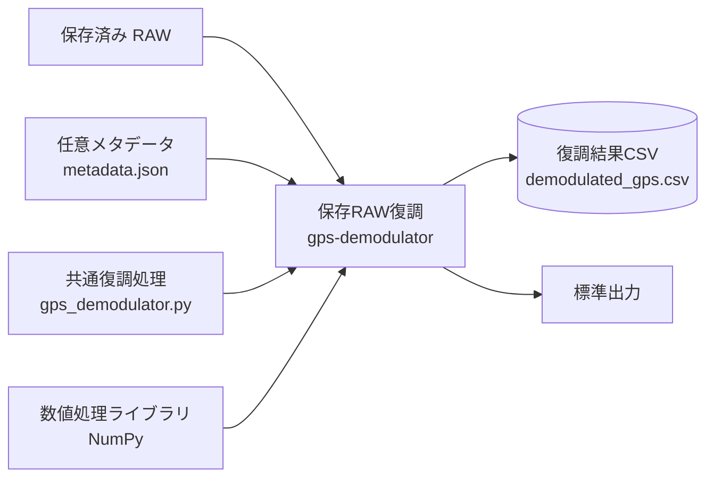

# gps-demodulator

## Service情報

| 項目 | 値 |
|---|---|
| Compose service | `gps-demodulator` |
| Container name | Compose自動採番 |
| Profile | `tools` |
| Build context | `./gps_receiver` |
| Dockerfile | `gps_receiver/Dockerfile` |
| Command | `python demodulate_gps.py ...` |
| Restart | なし |

## 入出力・依存関係図



保存済み入力を一度だけ読み、共通復調moduleを使ってCSVと標準出力へ結果を出します。API、`reverse-geocoder`、SQLite、Multiviewerとの接続はありません。

## 役割

保存済みのsingle-channel RAWまたはcapture directoryを読み、GPS/MODを単発復調してCSVへ出力します。常駐サービスではありません。

## 入力

| 入力 | 形式 | 既定path |
|---|---|---|
| capture directory | `ch{GPS_CHANNEL}.raw`、任意の `metadata.json` | `/app/input` |
| single raw | S16_LE mono raw | `/app/input` にbindした任意path |

ルートComposeのcommandは `GPS_DEMOD_INPUT_DIR` を1つの入力として渡します。

## 出力

| 出力 | 既定path |
|---|---|
| 復調CSV | `/app/output/demodulated_gps.csv` |
| 件数・先頭5件 | stdout |

CSV列:

```text
time,source,channel,offset_sec,lon,lat,alt,group,aircraft,payload_hex
```

## 依存関係

- `gps_receiver/gps_demodulator.py`
- NumPy
- host側に保存済みRAWが必要

`reverse-geocoder`、SQLite、MVには依存しません。

## Port

なし。Dockerfileは8010をEXPOSEしますが、このserviceはAPI processを起動せず、Composeにもport mappingはありません。

## Volume

| Host | Container | Mode | 用途 |
|---|---|---|---|
| `HOST_GPS_INPUT_DIR` | `/app/input` | ro | RAW入力 |
| `HOST_GPS_OUTPUT_DIR` | `/app/output` | rw | CSV出力 |
| `HOST_GPS_LOG_DIR` | `/app/logs` | rw | mountされるがCLIはfile logger未使用 |

## 環境変数

| 変数 | 既定例 | 内容 |
|---|---|---|
| `GPS_DEMOD_INPUT_DIR` | `/app/input` | CLI入力 |
| `GPS_DEMOD_OUTPUT_CSV` | `/app/output/demodulated_gps.csv` | CLI出力 |
| `GPS_CHANNEL` | `2` | capture directory内channel |
| `SAMPLE_RATE` | `48000` | sample rate |
| `GPS_BAUD` | `1200` | decoder default |
| `GPS_MARK_HZ` | `1200` | mark |
| `GPS_SPACE_HZ` | `1800` | space |

Compose commandからは `--limit-sec` を指定しません。全入力をメモリへ読みます。

## 関連API

なし。このコンテナはAPIを提供しません。

## 関連WF

WF-006 保存済みRAWの単発復調。

## 実行・ログ確認

```bash
docker compose --profile tools run --rm gps-demodulator
```

stdout確認:

```text
/app/input: N rows
wrote /app/output/demodulated_gps.csv rows=N
```

Docker file logやアプリrotating logは実装されていません。

## コンテナに入る

常駐しないため `exec` ではなく一時shellを起動します。

```bash
docker compose --profile tools run --rm --entrypoint sh gps-demodulator
```

## エラー時

- input不存在: `FileNotFoundError`
- 不正metadata/RAW: 未捕捉例外
- 復調0件: 正常終了しheaderのみCSV

