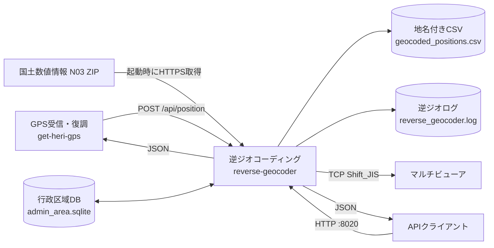

# reverse-geocoder

## Service情報

| 項目 | 値 |
|---|---|
| Compose service | `reverse-geocoder` |
| Container name | `reverse_geocoder` |
| Build context | `./reverse_geocoder` |
| Dockerfile | `reverse_geocoder/Dockerfile` |
| Image base | `python:3.12-slim` |
| Command | `/app/entrypoint.sh` |
| Restart | `unless-stopped` |

## 入出力・依存関係図



位置APIと起動時データ取得を入力として、SQLite検索、CSV保存、JSON応答、MV送信へ分岐します。Multiviewerは任意依存で、送信失敗は位置APIのHTTP失敗にはなりません。

## 役割

- N03行政区域データを取得しSQLiteへ構築する
- 緯度経度を都道府県・市区町村へ変換する
- 地名付き位置をCSVへ保存する
- 最新1件・直近100件をメモリ保持する
- 地名テキストをMVへTCP送信する
- 逆ジオAPIを提供する

## 入力

| 入力 | 形式 | 取得元 |
|---|---|---|
| 位置 | JSON | `POST /api/position` |
| 行政区域 | N03 ZIP/Shapefile | `GEOCODER_DATA_URL` |
| 既存DB | SQLite | `/app/data/admin_area.sqlite` |

## 出力

| 出力 | 保存/送信先 |
|---|---|
| 行政区域DB | `/app/data/admin_area.sqlite` |
| N03 ZIP cache | `/app/data/source/` |
| 地名CSV | `/app/output/geocoded_positions.csv` |
| 地名JSON | port 8020 API |
| MV command | `MULTIVIEWER_HOST:MULTIVIEWER_PORT` |
| ログ | `/app/logs/reverse_geocoder.log`、stdout/stderr |

## 依存関係

| 依存 | 必須度 | 備考 |
|---|---|---|
| 国土数値情報 | 初回/更新時 | 失敗時は既存DB、なければ空DB |
| SQLite file | API起動時必須 | entrypointが最低限schemaを作る |
| Multiviewer | 任意 | 失敗してもAPIは地名結果を返す |
| `get-heri-gps` | 依存される側 | 独立APIとしても利用可能 |

Compose `depends_on` はありません。

## Port

| Host | Container | Protocol | 用途 |
|---|---|---|---|
| `REVERSE_GEOCODER_PORT`、既定8020 | `PORT`、既定8020 | HTTP | 逆ジオAPI |

MVへは既定 `192.168.11.69:51069/TCP` のoutbound接続を行います。

## Volume

| Host | Container | Mode | 用途 |
|---|---|---|---|
| `HOST_GEOCODER_DATA_DIR` | `/app/data` | rw | DB、source ZIP |
| `HOST_GEOCODER_OUTPUT_DIR` | `/app/output` | rw | CSV |
| `HOST_GEOCODER_LOG_DIR` | `/app/logs` | rw | log |

## 環境変数

### Server・DB

| 変数 | 既定例 | 内容 |
|---|---|---|
| `HOST` | `0.0.0.0` | bind address |
| `PORT` | `8020` | bind port |
| `GEOCODER_DB_PATH` | `/app/data/admin_area.sqlite` | DB path |
| `GEOCODER_OUTPUT_CSV` | `/app/output/geocoded_positions.csv` | CSV path |
| `GEOCODER_AUTO_UPDATE` | `1` | entrypoint更新有効化 |
| `GEOCODER_UPDATE_DAYS` | `30` | freshness |
| `GEOCODER_FORCE_UPDATE` | `0` | 強制更新。example未記載 |
| `GEOCODER_DATA_URL` | N03 URL | ZIP URL |

### Multiviewer

| 変数 | 既定例 | 内容 |
|---|---|---|
| `MULTIVIEWER_ENABLED` | `1` | 送信有効化 |
| `MULTIVIEWER_HOST` | `192.168.11.69` | host |
| `MULTIVIEWER_PORT` | `51069` | port |
| `MULTIVIEWER_COMMAND_PREFIX` | `STW010V010` | prefix |
| `MULTIVIEWER_TEXT_TEMPLATE` | `{address_label}` | template |
| `MULTIVIEWER_ENCODING` | `shift_jis` | encoding |
| `MULTIVIEWER_TIMEOUT_SECONDS` | `2.0` | timeout |
| `MULTIVIEWER_SEND_ON_NOT_FOUND` | `0` | not found送信 |
| `MULTIVIEWER_DEDUP_TEXT` | `1` | 連続重複抑止 |

templateで利用可能なfield:

```text
address_label, prefecture, city, ward, lat, lon, alt, time
```

### ログ

| 変数 | 既定例 | 内容 |
|---|---|---|
| `LOG_DIR` | `/app/logs` | dir |
| `LOG_FILE` | `reverse_geocoder.log` | file |
| `LOG_LEVEL` | `INFO` | level |
| `LOG_MAX_BYTES` | `5242880` | rotation size |
| `LOG_BACKUP_COUNT` | `5` | generations |

## 関連API

- [reverse-geocoder API](../api/reverse-geocoder.md)

## 関連WF

- WF-004 逆ジオ・地名CSV・MV送信
- WF-005 行政区域DBの取得・再構築

## DB

- [database.md](../database.md)
- Tables: `areas`、`metadata`
- ORM/migration frameworkなし

## ログ確認

```bash
docker compose logs -f reverse-geocoder
tail -f reverse_geocoder/logs/reverse_geocoder.log
```

MV関連flow:

```text
flow=multiviewer sent
flow=multiviewer skipped
flow=multiviewer error
```

## コンテナに入る

```bash
docker compose exec reverse-geocoder sh
```

## ヘルス確認

```bash
curl http://127.0.0.1:8020/api/health
```

Compose healthcheckは未定義です。

## 起動時DB処理

1. `GEOCODER_AUTO_UPDATE != 0` ならimporter実行。
2. 更新失敗時は警告して継続。
3. DB fileがなければ `--empty` で空schema作成。
4. `python /app/app.py` 起動。

空DBで起動した場合、healthは `db_loaded:true` かつ `area_count:0` になります。
