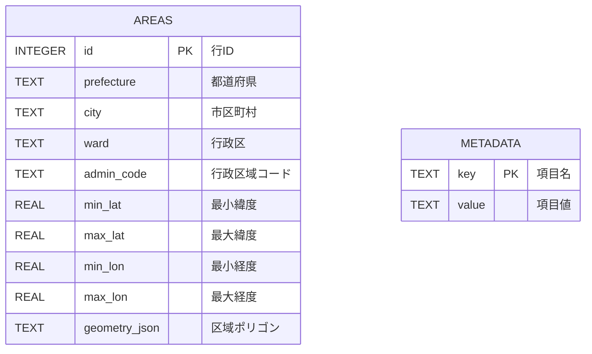

# Database

## 概要

DBを使用するのは `reverse-geocoder` だけです。

| 項目 | 値 |
|---|---|
| Engine | SQLite |
| 既定パス | `/app/data/admin_area.sqlite` |
| Host bind | `./reverse_geocoder/data/admin_area.sqlite` |
| 作成処理 | `reverse_geocoder/import_admin_areas.py` |
| 読取処理 | `reverse_geocoder/geocoder.py` |
| ORM | なし。標準 `sqlite3` |
| Migration | なし |
| Seed | 独立seedなし。N03インポートが初期データ投入を兼ねる |

実DB確認時点では `areas=7490`、`metadata=3` でした。件数はデータURLと更新時点により変わります。

## ER図

テーブル間の外部キー関連はありません。



`AREAS` と `METADATA` の間にリレーション線がないのは、外部キーが定義されていないためです。逆ジオ検索は `AREAS` のbbox列と `geometry_json` を使用し、`METADATA` はインポート時の生成情報だけを保持します。

## テーブル一覧

| テーブル | 概要 | 主な利用 |
|---|---|---|
| `areas` | N03行政区域の属性、bbox、ポリゴンrings | 逆ジオ検索 |
| `metadata` | DB生成元・生成時刻・件数 | importerが記録。現行APIは直接参照しない |

## areas

### 概要

1行がShapefileの1 shape recordに対応します。同じ自治体に複数行が存在する可能性があります。

### カラム

| カラム | 型 | NULL | Key/制約 | 内容 |
|---|---|---|---|---|
| `id` | INTEGER | 可の宣言だがPK | Primary Key | SQLite row id |
| `prefecture` | TEXT | NOT NULL | なし | 都道府県、N03_001 |
| `city` | TEXT | NOT NULL | なし | 市区町村、N03_004 |
| `ward` | TEXT | 可 | なし | 政令市の区等、N03_005 |
| `admin_code` | TEXT | 可 | なし | 行政区域コード、N03_007 |
| `min_lat` | REAL | NOT NULL | bbox index | 最小緯度 |
| `max_lat` | REAL | NOT NULL | bbox index | 最大緯度 |
| `min_lon` | REAL | NOT NULL | bbox index | 最小経度 |
| `max_lon` | REAL | NOT NULL | bbox index | 最大経度 |
| `geometry_json` | TEXT | NOT NULL | JSON文字列 | rings。各点は `[lon,lat]` |

### Primary Key

`id INTEGER PRIMARY KEY`

### Foreign Key

なし。

### Index

```sql
CREATE INDEX idx_areas_bbox
ON areas(min_lat, max_lat, min_lon, max_lon);
```

### 制約

- `prefecture`、`city`、bbox 4列、`geometry_json` はNOT NULL。
- unique制約、CHECK制約はありません。
- `geometry_json` のJSON妥当性をDB側で検証する制約はありません。

### 関連API

- `POST /api/position`: bbox SELECTとpoint-in-polygonに使用
- `GET /api/health`: `COUNT(*)` に使用

### 関連WF

- `WF-004`
- `WF-005`

### 実装箇所

- Schema: `reverse_geocoder/import_admin_areas.py:create_schema()`
- Insert: `reverse_geocoder/import_admin_areas.py:build_db()`
- Read: `reverse_geocoder/geocoder.py:AdminGeocoder.reverse()`
- Count: `reverse_geocoder/geocoder.py:AdminGeocoder.area_count()`

## metadata

### 概要

DB生成情報をkey/valueで保持します。

### カラム

| カラム | 型 | NULL | Key/制約 | 内容 |
|---|---|---|---|---|
| `key` | TEXT | PK | Primary Key | metadata名 |
| `value` | TEXT | NOT NULL | なし | 値 |

### Primary Key

`key TEXT PRIMARY KEY`

### Foreign Key

なし。

### Index

Primary KeyによりSQLite自動index `sqlite_autoindex_metadata_1` が作られます。

### 実データのkey

| key | 内容 |
|---|---|
| `source_url` | 取得元N03 ZIP URL |
| `created_at` | Unix timestamp文字列 |
| `area_count` | INSERTしたshape record件数。空DB作成時は存在しない |

### 関連API

現行APIはこのテーブルを直接読みません。

### 関連WF

`WF-005`

### 実装箇所

`reverse_geocoder/import_admin_areas.py:create_empty_db()`、`build_db()`

## DB操作

### 逆ジオ検索

まずbboxで候補を絞ります。

```sql
SELECT *
FROM areas
WHERE min_lat <= :lat
  AND max_lat >= :lat
  AND min_lon <= :lon
  AND max_lon >= :lon;
```

その後、Pythonで `geometry_json` をdecodeし、even-odd ruleのpoint-in-polygon判定を行います。

### 再構築

Migrationではなく、以下の破壊的再構築です。

```text
一時DB作成
↓
DROP/CREATE schema
↓
全N03 record INSERT
↓
metadata INSERT
↓
一時DBを本DBへreplace
```

本DBは一時DB完成後に置換されますが、schema version管理はありません。将来のschema変更手順は `TODO: 要確認` です。

## DBではない永続データ

| ファイル | 内容 |
|---|---|
| `gps_positions.csv` | GPS復調結果 |
| `geocoded_positions.csv` | 地名付き位置 |
| `source/*.zip` | 取得したN03 ZIP |

これらにPK、FK、index、transactionはありません。
