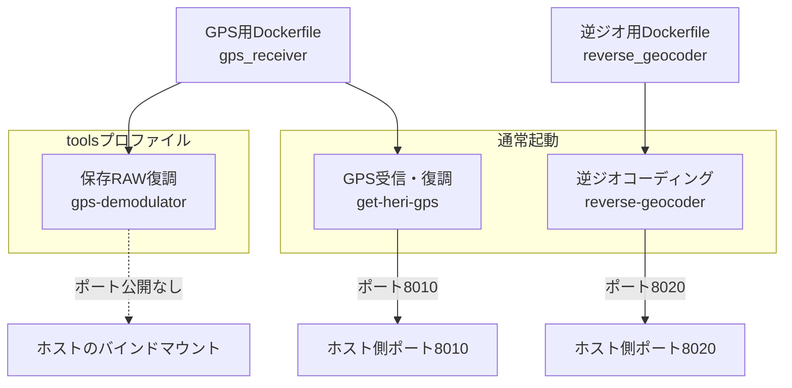
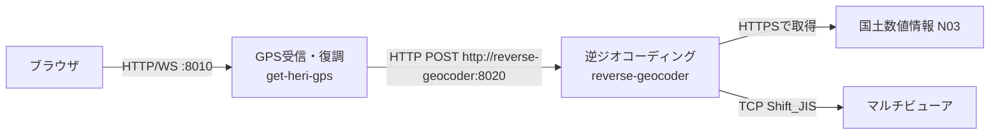
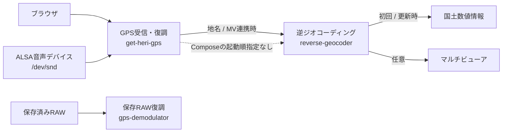

# Docker構成

## Composeサービス

ルートの `docker-compose.yml` には3サービスが定義されています。通常起動されるのは2サービスで、`gps-demodulator` は `tools` プロファイル指定時だけ実行されます。

| Service | Container name | Profile | Build context | Port | 概要 |
|---|---|---|---|---|---|
| `get-heri-gps` | `get_heri_gps` | 既定 | `./gps_receiver` | `8010:8010` | GPS音声入力、復調、CSV、UI/API |
| `gps-demodulator` | Compose自動採番 | `tools` | `./gps_receiver` | なし | 保存済みRAWを単発復調するCLI |
| `reverse-geocoder` | `reverse_geocoder` | 既定 | `./reverse_geocoder` | `8020:8020` | 地名検索、地名CSV、MV送信、API |



通常起動の2サービスと、`tools` プロファイルでのみ実行する単発サービスを分けて示しています。`get-heri-gps` と `gps-demodulator` は同じbuild contextとDockerfileを使用します。

詳細:

- [get-heri-gps](containers/get-heri-gps.md)
- [gps-demodulator](containers/gps-demodulator.md)
- [reverse-geocoder](containers/reverse-geocoder.md)

## 起動・停止・再ビルド

### 推奨起動

```bash
./start.sh
```

`start.sh` は不足している `.env` を `.env.example` から作成し、ホスト側ディレクトリを作った後、既存コンテナを削除して再作成します。

```text
docker compose down --remove-orphans
docker compose up -d --build --remove-orphans
```

### 手動起動

```bash
docker compose up -d --build --remove-orphans
```

### 停止

```bash
docker compose down --remove-orphans
```

### 状態確認

```bash
docker compose ps
```

### 全サービスのログ

```bash
docker compose logs -f
```

### 単発復調ツール

```bash
docker compose --profile tools run --rm gps-demodulator
```

## Dockerfile

### gps_receiver/Dockerfile

- Base: `python:3.12-slim`
- OS package: `alsa-utils`
- Python依存: FastAPI、Uvicorn、NumPy
- `WORKDIR /app`
- `EXPOSE 8010`
- Entry command: `python app.py`

### reverse_geocoder/Dockerfile

- Base: `python:3.12-slim`
- Python依存: FastAPI、Uvicorn、pyshp
- `WORKDIR /app`
- `EXPOSE 8020`
- Entry command: `/app/entrypoint.sh`

## Network

明示的なnetwork定義はなく、Compose既定bridge network `get_heri_gps_default` が作られます。



実線は実際に使用するHTTP、WebSocket、HTTPS、TCP通信です。Compose内では `get-heri-gps` から `reverse-geocoder` への通信だけがservice DNSを使用します。

サービス間通信では、Compose DNS名 `reverse-geocoder` を使用します。`depends_on`、healthcheck、再試行キューは定義されていません。

## Volume・device

| Service | Host | Container | Mode | 用途 |
|---|---|---|---|---|
| `get-heri-gps` | `./gps_receiver/output` | `/app/output` | rw | GPS CSV |
| `get-heri-gps` | `./gps_receiver/logs` | `/app/logs` | rw | ローテーションログ |
| `get-heri-gps` | `/dev/snd` | `/dev/snd` | rwm | ALSA音声入力 |
| `gps-demodulator` | `./gps_receiver/input` | `/app/input` | ro | 保存済みRAW入力 |
| `gps-demodulator` | `./gps_receiver/output` | `/app/output` | rw | 復調CSV |
| `gps-demodulator` | `./gps_receiver/logs` | `/app/logs` | rw | ログ用マウント。ただしCLIはアプリログを出力しない |
| `reverse-geocoder` | `./reverse_geocoder/data` | `/app/data` | rw | SQLite DB、取得ZIP |
| `reverse-geocoder` | `./reverse_geocoder/output` | `/app/output` | rw | 地名付きCSV |
| `reverse-geocoder` | `./reverse_geocoder/logs` | `/app/logs` | rw | ローテーションログ |

`get-heri-gps` は追加グループ `audio` で起動します。USB音声デバイスをコンテナ起動後に接続した場合、`/dev/snd` の再認識のためコンテナ再作成が必要になることがあります。

## 環境変数

### ルート .env

| 変数 | 例 | 用途 |
|---|---|---|
| `COMPOSE_PROJECT_NAME` | `get_heri_gps` | Composeプロジェクト名 |
| `GPS_RECEIVER_PORT` | `8010` | GPS UI/API公開ポート |
| `REVERSE_GEOCODER_PORT` | `8020` | 逆ジオAPI公開ポート |
| `GPS_RECEIVER_ENV_FILE` | `./gps_receiver/.env` | service envファイル |
| `REVERSE_GEOCODER_ENV_FILE` | `./reverse_geocoder/.env` | service envファイル |
| `HOST_GPS_OUTPUT_DIR` | `./gps_receiver/output` | GPS CSVのbind元 |
| `HOST_GPS_INPUT_DIR` | `./gps_receiver/input` | 単発RAW入力のbind元 |
| `HOST_GPS_LOG_DIR` | `./gps_receiver/logs` | GPSログのbind元 |
| `HOST_GEOCODER_DATA_DIR` | `./reverse_geocoder/data` | DBのbind元 |
| `HOST_GEOCODER_OUTPUT_DIR` | `./reverse_geocoder/output` | 地名CSVのbind元 |
| `HOST_GEOCODER_LOG_DIR` | `./reverse_geocoder/logs` | 逆ジオログのbind元 |
| `DOCKER_LOG_MAX_SIZE` | `10m` | Docker JSONログ1ファイル上限 |
| `DOCKER_LOG_MAX_FILE` | `3` | Docker JSONログ世代数 |
| `APP_PUBLIC_HOST` | `127.0.0.1` | `start.sh` の案内表示用 |

### get-heri-gps

| 変数 | 既定例 | 用途 |
|---|---|---|
| `HOST` | `0.0.0.0` | Uvicorn bind先 |
| `PORT` | `8010` | Uvicornポート |
| `SAMPLE_RATE` | `48000` | PCM sample rate |
| `GPS_BAUD` | `1200` | FSK baud |
| `GPS_MARK_HZ` | `1200` | mark周波数 |
| `GPS_SPACE_HZ` | `1800` | space周波数 |
| `INPUT_DEVICE` | `hw:2,0` | ALSA device |
| `INPUT_CHANNELS` | `2` | 入力総チャンネル数 |
| `GPS_CHANNEL` | `2` | GPSを含むチャンネル、1始まり |
| `CAPTURE_DEVICE_INCLUDE_KEYWORDS` | `AJA,...,USB Audio` | UIに表示するデバイス名フィルタ |
| `OUTPUT_CSV` | `/app/output/gps_positions.csv` | GPS CSV |
| `WINDOW_SECONDS` | `20.0` | 復調バッファ保持秒数 |
| `DECODE_INTERVAL_SECONDS` | `1.0` | 復調実行間隔 |
| `REVERSE_GEOCODER_URL` | `http://reverse-geocoder:8020/api/position` | 地名変換先 |
| `REVERSE_GEOCODER_TIMEOUT_SECONDS` | `3.0` | HTTP timeout |
| `GPS_DEMOD_INPUT_DIR` | `/app/input` | 単発復調入力 |
| `GPS_DEMOD_OUTPUT_CSV` | `/app/output/demodulated_gps.csv` | 単発復調出力 |
| `TEST_CAPTURE_DIR` | `../audio_capture/...` | test mode入力 |
| `LOG_DIR` | `/app/logs` | アプリログ保存先 |
| `LOG_FILE` | `gps_receiver.log` | ログ名 |
| `LOG_LEVEL` | `INFO` | ログレベル |
| `LOG_MAX_BYTES` | `5242880` | 1ログ上限 |
| `LOG_BACKUP_COUNT` | `5` | 世代数 |
| `LOG_PROGRESS_SECONDS` | `5` | 入力進捗ログ間隔 |

`INPUT_COMMAND` もコードから参照されますが `.env.example` にはありません。未指定時は `arecord` コマンドが自動生成されます。

### reverse-geocoder

| 変数 | 既定例 | 用途 |
|---|---|---|
| `HOST` | `0.0.0.0` | Uvicorn bind先 |
| `PORT` | `8020` | Uvicornポート |
| `GEOCODER_AUTO_UPDATE` | `1` | 起動時DB更新 |
| `GEOCODER_UPDATE_DAYS` | `30` | DB freshness日数 |
| `GEOCODER_FORCE_UPDATE` | `0` | 強制再構築。コード対応だがexample未記載 |
| `GEOCODER_DATA_URL` | N03 ZIP URL | 行政区域データ取得元 |
| `GEOCODER_DB_PATH` | `/app/data/admin_area.sqlite` | SQLite DB |
| `GEOCODER_OUTPUT_CSV` | `/app/output/geocoded_positions.csv` | 地名CSV |
| `MULTIVIEWER_ENABLED` | `1` | MV送信有効化 |
| `MULTIVIEWER_HOST` | `192.168.11.69` | MV送信先 |
| `MULTIVIEWER_PORT` | `51069` | MV TCP port |
| `MULTIVIEWER_COMMAND_PREFIX` | `STW010V010` | コマンド接頭辞 |
| `MULTIVIEWER_TEXT_TEMPLATE` | `{address_label}` | 送信文字列テンプレート |
| `MULTIVIEWER_ENCODING` | `shift_jis` | 文字コード |
| `MULTIVIEWER_TIMEOUT_SECONDS` | `2.0` | TCP timeout |
| `MULTIVIEWER_SEND_ON_NOT_FOUND` | `0` | 地名なし時にも送るか |
| `MULTIVIEWER_DEDUP_TEXT` | `1` | 同一文字列の連続送信抑止 |
| `LOG_DIR` | `/app/logs` | ログ保存先 |
| `LOG_FILE` | `reverse_geocoder.log` | ログ名 |
| `LOG_LEVEL` | `INFO` | ログレベル |
| `LOG_MAX_BYTES` | `5242880` | 1ログ上限 |
| `LOG_BACKUP_COUNT` | `5` | 世代数 |

## サービス間依存



矢印は実行時の入力または呼出し依存を示します。点線は、実際のHTTP呼出しはある一方でComposeの `depends_on` が定義されていないことを表します。


| 呼出元 | 呼出先 | プロトコル | 失敗時 |
|---|---|---|---|
| Browser | `get-heri-gps` | HTTP/WebSocket | UIにエラー、WSは1秒後再接続 |
| `get-heri-gps` | `reverse-geocoder` | HTTP POST | GPS CSVは保存継続、地名なしとして状態に記録 |
| `reverse-geocoder` | 国土数値情報 | HTTPS | 既存DBがあれば起動継続。なければ空DB作成 |
| `reverse-geocoder` | Multiviewer | TCP | APIは200を返し、`multiviewer.error` に格納 |

Compose上の `depends_on` はありません。起動順保証が必要かは `TODO: 要確認` です。

## 単独Compose

`gps_receiver/docker-compose.yml` と `reverse_geocoder/docker-compose.yml` でも各サービスを単独起動できます。別サーバへ分離する場合、`REVERSE_GEOCODER_URL` とMVネットワーク到達性を環境に合わせて変更します。
