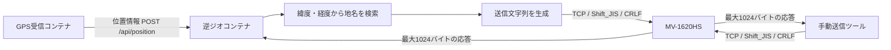
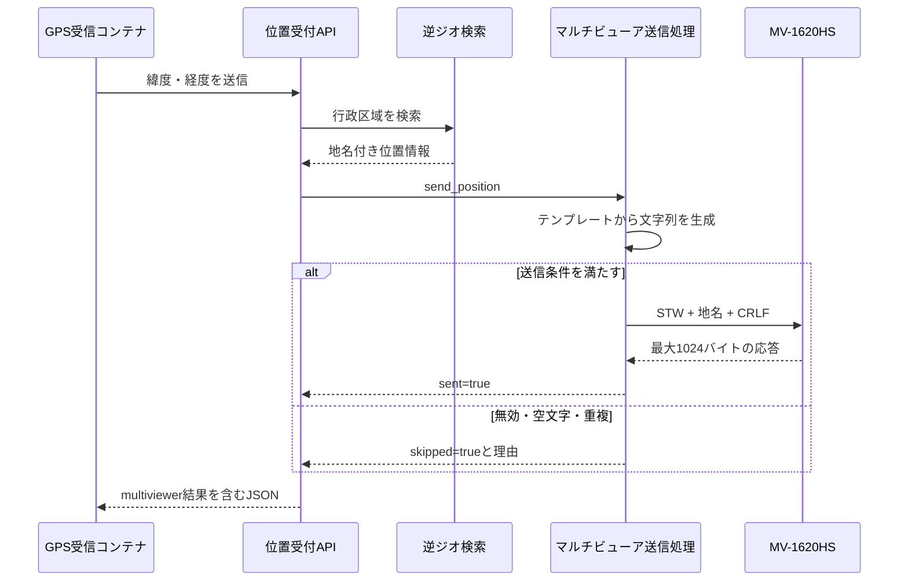

# マルチビューア連携仕様

## 概要

逆ジオコーディングで得た地名を、FOR-A / 朋栄 **MV-1620HS** のタイトル表示へTCPコマンドで送信します。

MV-1620HS側では、各ビデオウィンドウに表示できる **Title 1 / Title 2** のうち、原則として **Title 1** を使用します。
送信する地名は、MV-1620HSの **ウィンドウテキスト設定コマンド `STW`** により、対象レイアウト・対象ウィンドウのタイトル文字列として設定します。

送信方法は次の2種類です。

| 方式   | 実装                                | 起動契機                      |
| ---- | --------------------------------- | ------------------------- |
| 自動送信 | `reverse_geocoder/multiviewer.py` | `POST /api/position` の処理中 |
| 手動送信 | `send_multiviewer.py`             | ホストのターミナルから実行             |



通常運用では逆ジオコンテナが自動送信します。
手動送信ツールは、接続確認、同じ文字列の強制再送、表示先ウィンドウの切り分けに使用します。

## 対象機器

| 項目       | 内容                      |
| -------- | ----------------------- |
| 機器       | FOR-A / 朋栄 MV-1620HS    |
| 用途       | マルチビュー画面上のタイトル表示        |
| 使用機能     | ウィンドウタイトル表示、ウィンドウテキスト設定 |
| 使用コマンド   | `STW`                   |
| 通信方式     | LAN経由のTCPコマンド           |
| 文字コード    | Shift_JIS               |
| 終端       | CRLF                    |
| 実機確認済み応答 | `OK`                    |
| 実機確認済み表示 | `TEST` 表示成功             |

## 重要な前提

MV-1620HSは、番組本線にスーパーを焼き込む機器ではありません。
本仕様で行うのは、**MV-1620HSのマルチビュー出力上にある各ウィンドウのタイトル表示を書き換える処理**です。

つまり、表示対象は次のとおりです。

```text
MV-1620HSのマルチビュー画面
  └ ビデオウィンドウ
       └ Title 1 / Title 2
```

番組用SDIに文字を重ねる用途では、別途テロッパー、CG、キー合成機、スイッチャー等が必要です。

## 実機設定値

現時点の実機確認済み設定は次のとおりです。

| 項目           | 値                  |
| ------------ | ------------------ |
| MV-1620HS IP | `192.168.11.69`    |
| TCPポート       | `51069`            |
| コマンド接頭辞      | `STW010V010`       |
| 対象レイアウト      | Multi 1 / Layout 1 |
| デュアル出力モード    | 統合モード              |
| 対象ウィンドウ      | Video Window 1     |
| 対象タイトル       | Title 1            |
| 文字コード        | `shift_jis`        |
| 終端           | `\r\n`             |
| 確認済み応答       | `OK`               |
| 確認済み表示       | `TEST`             |

## 接続仕様

| 項目            | 既定値             | 内容                      |
| ------------- | --------------- | ----------------------- |
| Transport     | TCP             | 接続ごとに新しいTCP socketを作成   |
| Host          | `192.168.11.69` | MV-1620HSのIPアドレスまたはホスト名 |
| Port          | `51069`         | MV-1620HSのTCPコマンド待受ポート  |
| Encoding      | `shift_jis`     | コマンドと応答の文字コード           |
| Terminator    | `CRLF`          | 末尾へ `\r\n` を付加          |
| Timeout       | 自動送信2秒          | 接続と応答受信に使用              |
| Response size | 最大1024バイト       | `recv(1024)` を1回実行      |

TLS、認証、再送、永続キュー、接続の使い回しは実装されていません。

手動CLIのtimeoutは `reverse_geocoder/.env` またはshell環境変数を使用します。
どちらにも定義がない場合の既定値は5秒です。

## MV-1620HSのLANポート仕様

MV-1620HSのコマンド送受信用ポートは、機器側のLAN設定で決まります。

初期規則は次のとおりです。

```text
TCPポート = 51000 + IPアドレス第4オクテット
```

例:

| IPアドレス          |  TCPポート |
| --------------- | ------: |
| `192.168.0.10`  | `51010` |
| `192.168.1.170` | `51170` |
| `192.168.11.69` | `51069` |

注意点:

* IPを変更した場合、ポート番号も変わる可能性があります。
* MV-1620HS本体のLANメニューでポート番号を個別設定している場合は、本体設定値を優先します。
* LAN制御は、原則としてMV-1620HS 1台に対して制御PC 1台です。
* Layout Manager、Live Viewer、Webブラウザ等が接続中の場合、PowerShellやPythonからの接続が拒否される場合があります。
* 15秒間コマンドが送信されないと、MV-1620HS側でソケット接続を自動切断します。
* LANケーブル切断などで正規の切断処理がされなかった場合、数分間接続できないことがあります。その場合は、しばらく待つか本体を再起動します。

## 送信電文

### 基本形式

自動送信時の電文は次の形式です。

```text
{MULTIVIEWER_COMMAND_PREFIX}{rendered_text}\r\n
```

既定値で大阪府大阪市を送る場合:

```text
STW010V010大阪府大阪市\r\n
```

Python上では次の順に生成されます。

1. `MULTIVIEWER_TEXT_TEMPLATE` に位置情報を埋め込む。
2. 前後の空白を `strip()` で除去する。
3. `MULTIVIEWER_COMMAND_PREFIX` を先頭へ付ける。
4. `CRLF` を末尾へ付ける。
5. `MULTIVIEWER_ENCODING` でバイト列へ変換する。
6. TCP接続し、`sendall()` で送信する。
7. 最大1024バイトの応答を1回だけ受信する。

文字コード変換できない文字は `errors="replace"` により置換されます。
置換文字が機器上でどう表示されるかは未確認です。

## MV-1620HSコマンド仕様

### 使用コマンド: STW

本連携で使用するMV-1620HSのコマンドは、**ウィンドウテキスト設定 `STW`** です。

`STW` は、各レイアウト内のウィンドウに対するタイトル文字列を設定するコマンドです。

```text
STW + 設定対象 + デュアル出力モード + ウィンドウタイプ + ウィンドウ番号 + タイトル番号 + 文字データ + CRLF
```

### 既定接頭辞

既定の接頭辞は次のとおりです。

```text
STW010V010
```

内訳:

| 部分    | 意味              | 値                  |
| ----- | --------------- | ------------------ |
| `STW` | ウィンドウテキスト設定コマンド | 固定                 |
| `01`  | レイアウト番号         | Layout 1 / Multi 1 |
| `0`   | デュアル出力モード       | 統合モード              |
| `V`   | ウィンドウタイプ        | ビデオウィンドウ           |
| `01`  | ウィンドウ番号         | Window 1           |
| `0`   | タイトル番号          | Title 1            |

つまり、

```text
STW010V010TEST\r\n
```

は次の意味になります。

```text
Layout 1
統合モード
Video Window 1
Title 1
表示文字 TEST
```

### STWのパラメータ

| 位置   | パラメータ     | 内容                       |
| ---- | --------- | ------------------------ |
| 1-3  | `STW`     | 設定コマンド                   |
| 4-5  | `01`〜`16` | レイアウト番号 1〜16             |
| 6    | `0` / `1` | `0`=統合モード、`1`=独立モード      |
| 7    | `V` / `C` | `V`=ビデオウィンドウ、`C`=時計ウィンドウ |
| 8-9  | `01`〜`20` | ウィンドウ番号 1〜20             |
| 10   | `0` / `1` | `0`=Title 1、`1`=Title 2  |
| 11以降 | 文字データ     | Shift_JIS、最大16文字分        |
| 最後   | `CRLF`    | `\r\n`                   |

通常は、ビデオウィンドウのTitle 1を使用するため、接頭辞は次の形になります。

```text
STW{layout_no}0V{window_no}0
```

例:

| 対象                            | 接頭辞          |
| ----------------------------- | ------------ |
| Layout 1 / Window 1 / Title 1 | `STW010V010` |
| Layout 1 / Window 2 / Title 1 | `STW010V020` |
| Layout 1 / Window 3 / Title 1 | `STW010V030` |
| Layout 2 / Window 1 / Title 1 | `STW020V010` |
| Layout 1 / Window 1 / Title 2 | `STW010V011` |

## 表示文字の制限

MV-1620HSのSTWで送れる文字データは、**Shift_JISで最大16文字分**です。

注意点:

* 日本語はShift_JISで送信します。
* UTF-8で送ると文字化けする可能性があります。
* 文字数は機器仕様上「最大16文字分」です。
* 長い地名は途中で表示されない、または意図しない表示になる可能性があります。
* 逆ジオ側で短縮表示を検討する必要があります。

例:

| 地名          | 表示例          |
| ----------- | ------------ |
| `大阪府大阪市`    | そのまま表示可能     |
| `京都府京都市東山区` | そのまま、または短縮検討 |
| `大阪市北区`     | 短く見やすい       |
| `兵庫県神戸市中央区` | 16文字制限に注意    |

推奨テンプレート:

```dotenv
MULTIVIEWER_TEXT_TEMPLATE={city}{ward}
```

または

```dotenv
MULTIVIEWER_TEXT_TEMPLATE={prefecture}{city}
```

## Layout Manager側の表示条件

STWで `OK` が返っても、Layout Manager側のタイトル設定が正しくないと画面には表示されません。

対象ウィンドウのTitle 1で、次の設定が必要です。

| 項目        | 必要な設定     |
| --------- | --------- |
| タイトル表示    | ON        |
| テキストタイプ   | `Window`  |
| 表示文字数     | 0以外、通常16  |
| 文字サイズ     | 見えるサイズ    |
| 文字色       | 背景と同化しない色 |
| 透明度       | 見える設定     |
| 表示位置      | 画面内       |
| エッジ / マット | 必要に応じてON  |

特に重要なのは、**テキストタイプを `Window` にすること**です。

| テキストタイプ  | 表示内容              |
| -------- | ----------------- |
| `Window` | STWで設定したウィンドウテキスト |
| `Source` | ソース名              |
| `Format` | 入力フォーマット名         |

STWで送った文字列を表示したい場合は、必ず `Window` を選択します。

## Layout Managerのバージョン注意

実機では、Layout Managerをオンライン接続しようとした際に、

```text
MV-1620HS本体のバージョンが古いため接続できません
```

という表示が出る場合があります。

この場合、Layout Manager V3系とMV-1620HS本体ファームの世代が合っていない可能性があります。

対応方針:

1. 本体付属CD-ROMに入っていた古いLayout Managerを使用する。
2. FOR-A / 朋栄に本体ファーム更新可否を確認する。
3. タイトル位置・サイズ変更が不要であれば、PowerShell / PythonのSTW送信だけで運用する。

現時点では、STWコマンド送信により `TEST` 表示まで確認できているため、リアルタイム文字更新はLayout Managerなしでも可能です。
ただし、タイトルの位置・サイズ・表示ON/OFFを変更する場合は、対応するLayout Managerまたは本体ファーム更新が必要です。

## 編集専用画面の注意

MV-1620HSには、通常のマルチ画面とは別に **編集専用画面** があります。

実機では、RDP応答により編集専用画面がONになっていることが確認されました。
この状態では、STWで `OK` が返っても通常のマルチ画面に見えない場合があります。

編集専用画面をOFFにするコマンド:

```text
SED010\r\n
```

意味:

| 部分    | 意味         |
| ----- | ---------- |
| `SED` | 編集専用画面表示設定 |
| `0`   | 統合モード      |
| `1`   | OUT1       |
| `0`   | 編集専用画面OFF  |

通常運用前に、必要に応じて次を送ります。

```text
SED010\r\n
STW010V010TEST\r\n
```

## 状態確認コマンド

現在の出力状態を確認するには、RDPコマンドを使用します。

```text
RDPVR01\r\n
```

応答例:

```text
ADPVR010110101110101
```

RDP応答には、次の情報が含まれます。

| 項目          | 内容           |
| ----------- | ------------ |
| デュアル出力モード   | 統合 / 独立      |
| OUT1編集専用画面  | ON / OFF     |
| OUT1フル/マルチ  | フル画面 / マルチ画面 |
| OUT1フル画面ソース | ソース番号        |
| OUT1マルチ画面番号 | Multi番号      |
| OUT2編集専用画面  | ON / OFF     |
| OUT2フル/マルチ  | フル画面 / マルチ画面 |
| OUT2フル画面ソース | ソース番号        |
| OUT2マルチ画面番号 | Multi番号      |

表示されない場合は、まずRDPで次を確認します。

1. 現在表示中がMulti 1か。
2. 編集専用画面がOFFか。
3. フル画面ではなくマルチ画面になっているか。
4. 統合モードか独立モードか。

## 自動送信フロー



逆ジオ結果のCSV保存後にマルチビューア送信を行います。
送信結果は位置APIの `multiviewer` フィールド、最新位置、履歴へ格納されます。

### 使用可能なテンプレート項目

`MULTIVIEWER_TEXT_TEMPLATE` では次の項目を使用できます。

| 項目                | 内容                   |
| ----------------- | -------------------- |
| `{address_label}` | 通常は都道府県と市区町村を連結した表示名 |
| `{prefecture}`    | 都道府県                 |
| `{city}`          | 市区町村                 |
| `{ward}`          | 行政区                  |
| `{lat}`           | 緯度                   |
| `{lon}`           | 経度                   |
| `{alt}`           | 高度                   |
| `{time}`          | GPS位置の時刻             |

既定テンプレート:

```text
{address_label}
```

例:

```dotenv
MULTIVIEWER_TEXT_TEMPLATE={prefecture}{city}{ward}
```

テンプレートに存在しない項目名を指定した場合、`address_label` だけへフォールバックします。

## 送信判定

`send_text()` は次の順に送信可否を判定します。

| 順序 | 条件                      | 結果                            |
| -- | ----------------------- | ----------------------------- |
| 1  | `MULTIVIEWER_ENABLED=0` | `disabled` としてスキップ            |
| 2  | Hostが空                  | `host not configured` としてスキップ |
| 3  | 生成文字列が空                 | `empty text` としてスキップ          |
| 4  | 重複抑止有効かつ直前の送信成功文字列と同一   | `duplicate text` としてスキップ      |
| 5  | 上記以外                    | TCP送信                         |

重複判定はプロセスメモリ上の `_last_text` だけで行います。

* 送信成功後にだけ `_last_text` を更新します。
* コンテナを再起動すると記録は消えます。
* 時間経過による解除はありません。
* 文字列が同じなら、位置や時刻が変わってもスキップされます。

## 地名が見つからない場合

`MULTIVIEWER_SEND_ON_NOT_FOUND=0` が既定です。
この場合、逆ジオ結果が `ok:false` なら空文字となり、送信されません。

`MULTIVIEWER_SEND_ON_NOT_FOUND=1` にすると、逆ジオ失敗時もテンプレートを評価します。
ただし、既定テンプレート `{address_label}` では空文字になるため、実際には `empty text` でスキップされる可能性があります。

## 環境変数

設定先は `reverse_geocoder/.env` です。

| 変数                              | 既定値               | 内容                     |
| ------------------------------- | ----------------- | ---------------------- |
| `MULTIVIEWER_ENABLED`           | `1`               | 自動送信の有効・無効             |
| `MULTIVIEWER_HOST`              | `192.168.11.69`   | 送信先                    |
| `MULTIVIEWER_PORT`              | `51069`           | TCPポート                 |
| `MULTIVIEWER_COMMAND_PREFIX`    | `STW010V010`      | テキスト前に付けるMV-1620HSコマンド |
| `MULTIVIEWER_TEXT_TEMPLATE`     | `{address_label}` | 送信文字列テンプレート            |
| `MULTIVIEWER_ENCODING`          | `shift_jis`       | 送受信文字コード               |
| `MULTIVIEWER_TIMEOUT_SECONDS`   | `2.0`             | 自動送信の接続・受信timeout      |
| `MULTIVIEWER_SEND_ON_NOT_FOUND` | `0`               | 地名なし結果をテンプレートへ渡すか      |
| `MULTIVIEWER_DEDUP_TEXT`        | `1`               | 同一文字列の連続送信抑止           |

設定値はコンテナ生成時に環境変数として渡され、module import時に読み込まれます。
`.env` 変更後はコンテナの再作成が必要です。

```bash
docker compose up -d --force-recreate reverse-geocoder
```

## API応答

### 送信成功

`POST /api/position` のレスポンスに次の情報が追加されます。

```json
{
  "multiviewer": {
    "enabled": true,
    "sent": true,
    "skipped": false,
    "host": "192.168.11.69",
    "port": 51069,
    "prefix": "STW010V010",
    "text": "大阪府大阪市",
    "response": "OK"
  }
}
```

`response` の値は機器が返した内容です。
実機では `OK` 応答を確認済みです。

### スキップ

```json
{
  "multiviewer": {
    "enabled": true,
    "sent": false,
    "skipped": true,
    "reason": "duplicate text",
    "text": "大阪府大阪市"
  }
}
```

`reason` は `disabled`、`host not configured`、`empty text`、`duplicate text` のいずれかです。

### 通信エラー

```json
{
  "multiviewer": {
    "enabled": true,
    "sent": false,
    "skipped": false,
    "error": "接続エラー内容"
  }
}
```

socket例外は `POST /api/position` 内で捕捉されます。
マルチビューア送信が失敗しても、位置APIは通常HTTP 200を返し、地名結果とCSV保存は維持されます。

応答受信だけがtimeoutした場合は空応答として送信成功扱いになります。

## 手動送信

ホストから直接送信します。
Dockerコンテナや逆ジオAPIは使用しません。

```bash
cd /home/ubuntu/app/hericheck/get_heri_gps
python3 send_multiviewer.py 大阪府大阪市
```

送信先を指定する例:

```bash
python3 send_multiviewer.py 大阪府大阪市 \
  --host 192.168.11.69 \
  --port 51069
```

完全なコマンドを送る場合:

```bash
python3 send_multiviewer.py STW010V010LIVE --raw
```

`--raw` でも末尾のCRLFは自動で追加されます。

### CLI引数

| 引数           | 必須 | 既定値                    | 内容                   |
| ------------ | -- | ---------------------- | -------------------- |
| `text`       | 必須 | なし                     | 送信する文字列              |
| `--host`     | 任意 | envまたは `192.168.11.69` | 送信先                  |
| `--port`     | 任意 | envまたは `51069`         | TCPポート               |
| `--prefix`   | 任意 | envまたは `STW010V010`    | 接頭辞                  |
| `--encoding` | 任意 | envまたは `shift_jis`     | 文字コード                |
| `--timeout`  | 任意 | envまたは `5.0`           | 接続・応答待ち秒数            |
| `--raw`      | 任意 | 無効                     | `text` を完全なコマンドとして扱う |

設定値の優先順位:

1. コマンドライン引数
2. shell環境変数
3. `reverse_geocoder/.env`
4. スクリプト内既定値

手動CLIには、自動送信の有効・無効、テンプレート、地名なし判定、重複抑止は適用されません。

## PowerShellでの確認方法

Windows上で簡易確認する場合は、次のPowerShellを使用します。

```powershell
$ip = "192.168.11.69"
$port = 51069

function Send-MVCommand($cmdText) {
    $client = New-Object System.Net.Sockets.TcpClient
    try {
        $client.Connect($ip, $port)
        $stream = $client.GetStream()

        $cmd = $cmdText + "`r`n"
        $enc = [System.Text.Encoding]::GetEncoding("shift_jis")
        $bytes = $enc.GetBytes($cmd)

        $stream.Write($bytes, 0, $bytes.Length)

        $buffer = New-Object byte[] 1024
        $read = $stream.Read($buffer, 0, $buffer.Length)

        $response = [System.Text.Encoding]::GetEncoding("shift_jis").GetString($buffer, 0, $read)
        Write-Host $response

        $stream.Close()
    }
    catch {
        Write-Host "ERROR: $($_.Exception.Message)"
    }
    finally {
        $client.Close()
    }
}

Send-MVCommand "STW010V010TEST"
```

編集専用画面をOFFにする場合:

```powershell
Send-MVCommand "SED010"
```

現在状態を確認する場合:

```powershell
Send-MVCommand "RDPVR01"
```

複数ウィンドウへ番号を出して、対象ウィンドウ番号を確認する場合:

```powershell
for ($win = 1; $win -le 20; $win++) {
    $winText = "{0:D2}" -f $win
    Send-MVCommand ("STW010V" + $winText + "0W" + $winText)
}
```

## ログと確認

自動送信ログ:

```bash
docker compose logs -f reverse-geocoder
tail -f reverse_geocoder/logs/reverse_geocoder.log
```

主なログ:

```text
flow=multiviewer sent ...
flow=multiviewer skipped ...
flow=multiviewer error ...
```

最新の送信結果は次のAPIでも確認できます。

```bash
curl http://127.0.0.1:8020/api/latest
```

手動接続確認:

```bash
python3 send_multiviewer.py 大阪府大阪市
```

## エラー確認

| 症状                     | 実装上の状態                      | 確認項目                                           |
| ---------------------- | --------------------------- | ---------------------------------------------- |
| `No route to host`     | socket接続失敗                  | IPセグメント、VLAN、経路、LAN、機器電源                       |
| `Connection refused`   | TCP接続拒否                     | IP、ポート、MV側の外部制御待受、他ソフトの接続                      |
| `timed out`            | 接続または応答待ちtimeout            | 接続先、ファイアウォール、timeout値、MV側の応答待ち                 |
| `duplicate text`       | 同一文字列の連続送信を抑止               | `MULTIVIEWER_DEDUP_TEXT`                       |
| `empty text`           | 生成文字列が空                     | 逆ジオ結果、テンプレート、地名なし設定                            |
| `OK`だが表示されない           | コマンドは成功、表示条件が未設定            | Layout ManagerのTitle設定、Window番号、Multi番号、編集専用画面 |
| `Title1`のまま変わらない       | テキストタイプ違い、または対象違い           | テキストタイプを`Window`にする、対象Window番号を確認              |
| IP変更後に拒否される            | ポート番号が古い                    | `51000 + 第4オクテット` のポートに変更                      |
| Layout Managerがオンライン不可 | 本体ファームとLayout Managerの世代不一致 | 付属CD版Layout Manager、または本体ファーム更新を確認             |
| 文字化け                   | 文字コードまたは使用可能文字の不一致          | `MULTIVIEWER_ENCODING=shift_jis`、文字数制限、機器フォント  |

## 表示されない場合の切り分け手順

1. `ping 192.168.11.69` が通るか確認する。
2. TCPポートが `51069` で合っているか確認する。
3. PowerShellで `STW010V010TEST` を送り、`OK` が返るか確認する。
4. `RDPVR01` を送り、現在表示中のMulti番号と編集専用画面ON/OFFを確認する。
5. 編集専用画面がONなら `SED010` を送る。
6. Layout Manager側でTitle 1の表示がONか確認する。
7. テキストタイプが `Window` か確認する。
8. Window番号が違う可能性がある場合、Window 1〜20に `W01`〜`W20` を送って確認する。
9. Layout Manager、Live Viewer、Webブラウザ等の接続を終了してから再試行する。
10. 正規切断されず接続できない場合は数分待つか、MV-1620HS本体を再起動する。

## 実装箇所

| 処理          | 実装                                                |
| ----------- | ------------------------------------------------- |
| 位置APIからの呼出し | `reverse_geocoder/app.py:post_position()`         |
| テンプレート展開    | `reverse_geocoder/multiviewer.py:render_text()`   |
| 自動TCP送信     | `reverse_geocoder/multiviewer.py:send_text()`     |
| 自動送信入口      | `reverse_geocoder/multiviewer.py:send_position()` |
| 手動TCP送信     | `send_multiviewer.py:send_command()`              |
| 手動CLI       | `send_multiviewer.py:main()`                      |

## 関連ドキュメント

* [アーキテクチャ](architecture.md)
* [ワークフロー WF-004・WF-008](workflows.md)
* [reverse-geocoder API](api/reverse-geocoder.md)
* [reverse-geocoderコンテナ](containers/reverse-geocoder.md)
