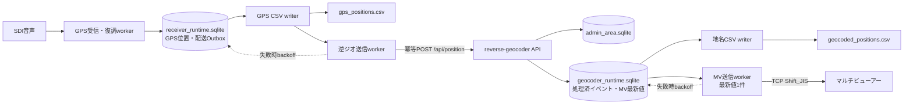
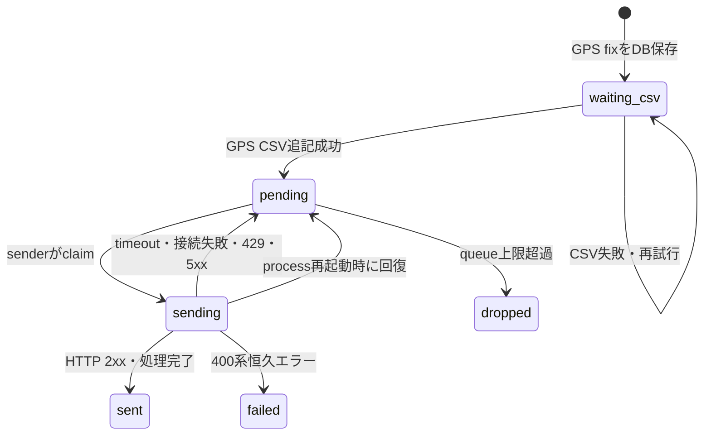

# 非同期連携・再送設計

> Status: 設計案（未実装）  
> 対象: `get-heri-gps`、`reverse-geocoder`、マルチビューアー連携

## 1. 目的

SDI受信・GPS復調を、逆ジオAPIやマルチビューアーの停止・遅延から切り離します。

この設計で保証することは次のとおりです。

1. 逆ジオAPIが停止してもSDI受信とGPS復調を継続する。
2. GPS位置をローカル保存してから外部送信する。
3. 未送信データをコンテナ再起動後も再送できる。
4. 同じGPSイベントを再送しても地名CSVへ重複登録しない。
5. マルチビューアー復旧時に古い地名を順番に表示しない。
6. GPS受信、地名変換、マルチビューアー送信を個別に監視する。

## 2. 対象外

- RabbitMQ、Kafka等の外部メッセージブローカー導入
- 複数ノードでのactive-active構成
- API認証・TLS導入
- GPS CSVとSQLiteの完全な分散トランザクション

## 3. 現行構成の問題

現行の`gps_receiver/app.py:worker_main()`は、同じworker thread内で次を同期実行します。

```text
音声読取り
→ GPS復調
→ POST /api/position（最大3秒待機）
→ GPS CSV追記
→ 音声読取りへ戻る
```

`reverse_geocoder/app.py:post_position()`も、API request内で次を同期実行します。

```text
SQLite検索
→ 地名CSV追記
→ マルチビューアーTCP送信（最大2秒待機）
→ HTTP応答
```

このため、逆ジオまたはマルチビューアーの遅延が上流へ伝播します。再送、永続キュー、冪等性キーもありません。

## 4. 目標構成



左から右が通常のデータフローです。SQLiteを正本とし、CSVと外部通信を独立したworkerで処理します。

## 5. コンポーネント設計

### 5.1 get-heri-gps

| Component | Thread | 責務 |
|---|---:|---|
| FastAPI/Uvicorn | event loop | UI、設定、開始停止、状態API、WebSocket |
| capture worker | 1 | ALSA読取り、チャンネル抽出、復調、イベント永続化 |
| GPS CSV worker | 1 | 未出力GPSをCSVへ追記し、配送可能にする |
| geocode sender | 1 | Outbox取得、HTTP POST、再送制御 |
| maintenance | sender内で定期実行 | retention、queue上限処理、異常状態の回復 |

### 5.2 reverse-geocoder

| Component | Thread | 責務 |
|---|---:|---|
| FastAPI/Uvicorn | event loop | 位置受付、冪等性確認、逆ジオ結果返却 |
| geocoded CSV worker | 1 | 未出力の地名付き結果をCSVへ追記 |
| MV sender | 1 | 最新地名だけをTCP送信し、失敗時再送 |
| importer | 起動時process | N03取得、`admin_area.sqlite`再構築 |

`post_position()`はマルチビューアーTCP応答を待ちません。

## 6. イベント識別子

復調したGPS位置ごとにreceiverでUUID v4の`event_id`を1回だけ発行します。同じイベントを再送するときは同じIDを使用します。

```text
event_id = 550e8400-e29b-41d4-a716-446655440000
```

既存の復調重複判定`(offset_sec, payload_hex)`は、同じ録音windowから同じfixを複数登録しないため引き続き使用します。その判定を通過した時点で`event_id`を発行します。

## 7. receiver_runtime.sqlite

既定パス:

```text
/app/data/receiver_runtime.sqlite
```

ホストbind mount:

```text
./gps_receiver/data/receiver_runtime.sqlite
```

### 7.1 gps_fixes

```sql
CREATE TABLE gps_fixes (
    event_id TEXT PRIMARY KEY,
    observed_at TEXT NOT NULL,
    observed_at_iso TEXT NOT NULL,
    source TEXT NOT NULL,
    channel INTEGER NOT NULL,
    offset_sec REAL NOT NULL,
    lon REAL NOT NULL,
    lat REAL NOT NULL,
    alt INTEGER,
    group_no INTEGER,
    aircraft_no INTEGER,
    payload_hex TEXT NOT NULL,
    csv_status TEXT NOT NULL DEFAULT 'pending',
    csv_written_at REAL,
    created_at REAL NOT NULL
);

CREATE INDEX idx_gps_fixes_csv
ON gps_fixes(csv_status, created_at);
```

`group`はSQL予約語との混同を避け、DB列では`group_no`とします。

### 7.2 geocode_outbox

```sql
CREATE TABLE geocode_outbox (
    event_id TEXT PRIMARY KEY,
    status TEXT NOT NULL DEFAULT 'waiting_csv',
    attempt_count INTEGER NOT NULL DEFAULT 0,
    next_attempt_at REAL NOT NULL,
    last_attempt_at REAL,
    sent_at REAL,
    last_http_status INTEGER,
    last_error TEXT,
    created_at REAL NOT NULL,
    FOREIGN KEY(event_id) REFERENCES gps_fixes(event_id)
);

CREATE INDEX idx_geocode_outbox_ready
ON geocode_outbox(status, next_attempt_at, created_at);
```

### 7.3 pipeline_stats

```sql
CREATE TABLE pipeline_stats (
    key TEXT PRIMARY KEY,
    value INTEGER NOT NULL DEFAULT 0,
    updated_at REAL NOT NULL
);
```

次のcounterを保持します。

| key | 内容 |
|---|---|
| `queue_overflow_total` | 上限超過で配送対象から外した件数 |
| `geocode_retry_total` | HTTP再送回数 |
| `geocode_failed_total` | 恒久エラー件数 |
| `csv_recovery_total` | 起動時CSV整合処理件数 |

## 8. receiverの状態遷移



### Atomic claim

senderは1 transaction内で対象を取得し、`sending`へ変更します。

```sql
BEGIN IMMEDIATE;

SELECT event_id
FROM geocode_outbox
WHERE status = 'pending'
  AND next_attempt_at <= :now
ORDER BY next_attempt_at, created_at
LIMIT 1;

UPDATE geocode_outbox
SET status = 'sending',
    last_attempt_at = :now
WHERE event_id = :event_id
  AND status = 'pending';

COMMIT;
```

現行はsender 1本ですが、二重送信を避けるためclaimを明示します。

## 9. GPS保存順序

GPS fix取得時は次の順序です。

```text
1. gps_fixesとgeocode_outboxを同じSQLite transactionでINSERT
2. capture workerは次の音声読取りへ戻る
3. CSV workerがgps_positions.csvへ追記してflush
4. gps_fixes.csv_statusをwrittenへ更新
5. geocode_outbox.statusをpendingへ更新
6. senderがHTTP送信可能になる
```

外部送信は必ず手順5の後なので、CSV保存より先に実行されません。

### CSV crash recovery

`gps_positions.csv`へ`event_id`列を追加します。起動時にCSVのevent IDを読み、DBと照合します。

- CSVに存在しDBが`pending`: DBを`written`へ補正する。
- DBに存在しCSVにない: CSVへ追記する。
- 同じ`event_id`がCSVに複数ある: ログ警告し、将来の追記では重複させない。

SQLiteが正本で、CSVは再生成可能な出力と位置付けます。

## 10. 逆ジオAPI契約

### Request

```http
POST /api/position
Content-Type: application/json
```

```json
{
  "event_id": "550e8400-e29b-41d4-a716-446655440000",
  "time": "2026/06/22 14:32:10",
  "time_iso": "2026-06-22T14:32:10.000000+09:00",
  "lat": 34.693725,
  "lon": 135.502254,
  "alt": 120,
  "source": "get_heri_gps",
  "channel": 2
}
```

### Success response

```json
{
  "ok": true,
  "event_id": "550e8400-e29b-41d4-a716-446655440000",
  "duplicate": false,
  "prefecture": "大阪府",
  "city": "大阪市",
  "ward": "",
  "address_label": "大阪府大阪市",
  "admin_code": "27100",
  "multiviewer": {
    "status": "pending"
  }
}
```

同じ`event_id`を再受信した場合は保存済みresponseを返します。

```json
{
  "ok": true,
  "event_id": "550e8400-e29b-41d4-a716-446655440000",
  "duplicate": true,
  "address_label": "大阪府大阪市",
  "multiviewer": {
    "status": "pending"
  }
}
```

重複も正常に処理済みなのでHTTP 200とします。

### Status code

| Code | senderの扱い | 条件 |
|---:|---|---|
| 200 | `sent` | 正常、重複、区域外を含む処理完了 |
| 400 | `failed` | event_id、lat、lon等の不正 |
| 409 | `failed` | 同じevent_idでpayloadが異なる |
| 429 | 再送 | 過負荷 |
| 500-599 | 再送 | サーバ内部障害 |
| timeout/connect error | 再送 | 通信障害 |

区域外は業務結果であり通信失敗ではないため、`ok:false`を含むHTTP 200で完了扱いにします。

## 11. geocoder_runtime.sqlite

行政区域DBは再構築時に置換されるため、実行時データは別DBへ保存します。

既定パス:

```text
/app/data/geocoder_runtime.sqlite
```

### 11.1 processed_positions

```sql
CREATE TABLE processed_positions (
    event_id TEXT PRIMARY KEY,
    request_hash TEXT NOT NULL,
    request_json TEXT NOT NULL,
    response_json TEXT NOT NULL,
    address_label TEXT NOT NULL,
    csv_status TEXT NOT NULL DEFAULT 'pending',
    csv_written_at REAL,
    processed_at REAL NOT NULL
);

CREATE INDEX idx_processed_positions_csv
ON processed_positions(csv_status, processed_at);
```

同じ`event_id`で`request_hash`が異なる場合はHTTP 409にします。

### 11.2 mv_latest

履歴キューではなく、1行だけの最新値スロットです。

```sql
CREATE TABLE mv_latest (
    slot INTEGER PRIMARY KEY CHECK(slot = 1),
    generation INTEGER NOT NULL,
    event_id TEXT NOT NULL,
    text TEXT NOT NULL,
    status TEXT NOT NULL,
    attempt_count INTEGER NOT NULL DEFAULT 0,
    next_attempt_at REAL NOT NULL,
    last_attempt_at REAL,
    sent_at REAL,
    last_error TEXT,
    updated_at REAL NOT NULL
);
```

新しい地名を受け取るたびに`generation`を1増やしてUPSERTします。

```sql
INSERT INTO mv_latest(...)
VALUES(1, 1, ...)
ON CONFLICT(slot) DO UPDATE SET
    generation = mv_latest.generation + 1,
    event_id = excluded.event_id,
    text = excluded.text,
    status = 'pending',
    attempt_count = 0,
    next_attempt_at = excluded.next_attempt_at,
    last_error = NULL,
    updated_at = excluded.updated_at;
```

## 12. マルチビューアー送信競合

MV workerが大阪市を送信中に、新しい堺市が登録される場合があります。

```text
workerが generation=10（大阪市）を取得
→ APIが generation=11（堺市）へ更新
→ 大阪市のTCP送信が成功
→ workerは WHERE generation=10 でsent更新
→ 0件更新となる
→ generation=11（堺市）はpendingのまま送信される
```

更新SQL:

```sql
UPDATE mv_latest
SET status = 'sent', sent_at = :now
WHERE slot = 1
  AND generation = :generation;
```

これにより、古い送信結果で新しい状態を上書きしません。

## 13. Retry policy

### 計算式

```text
base = min(RETRY_MAX_SECONDS, RETRY_INITIAL_SECONDS * 2 ^ attempt_count)
delay = base * random(0.8, 1.2)
next_attempt_at = now + delay
```

既定値:

```env
GEOCODE_RETRY_INITIAL_SECONDS=1
GEOCODE_RETRY_MAX_SECONDS=30
GEOCODE_RETRY_JITTER_RATIO=0.2
MV_RETRY_INITIAL_SECONDS=1
MV_RETRY_MAX_SECONDS=30
MV_RETRY_JITTER_RATIO=0.2
```

`attempt_count`に上限は設けず、キュー上限と保持期間で制御します。一時的な長時間停止から自動復旧できることを優先します。

## 14. Queue上限と削除方針

### 逆ジオOutbox

```env
GEOCODE_QUEUE_MAX_ITEMS=10000
GEOCODE_SENT_RETENTION_DAYS=7
GEOCODE_FAILED_RETENTION_DAYS=30
```

上限は`waiting_csv`、`pending`、`sending`のactive件数に対して適用します。

上限到達時:

1. GPS fixとGPS CSVは保存する。
2. 最古の`pending`配送を`dropped`へ変更する。
3. `queue_overflow_total`を加算する。
4. ERRORログとUI警告を出す。
5. 新しい位置を配送対象にする。

最新位置を優先する方針です。全位置の逆ジオ結果が必須なら、dropではなくGPS受信停止またはディスク容量ベース制御へ要件変更が必要です。

### MV queue

常に1件です。新しい位置が古い位置を上書きするため、件数上限処理は不要です。

## 15. 起動・停止

### get-heri-gps起動

```text
1. receiver_runtime.sqliteをopen
2. schema version確認・migration
3. status=sendingをpendingへ戻す
4. GPS CSVとDBをevent_idでreconcile
5. CSV workerを開始
6. geocode senderを開始
7. FastAPIを受付可能にする
8. UI操作後にcapture workerを開始
```

### get-heri-gps停止

```text
1. 新規captureを停止
2. CSV workerへ停止要求
3. senderへ停止要求
4. 最大SHUTDOWN_GRACE_SECONDS待機
5. 未完了データはSQLiteへ残して終了
```

### reverse-geocoder起動

```text
1. N03 DBを確認・必要なら更新
2. geocoder_runtime.sqliteをopen・migration
3. MV status=sendingをpendingへ戻す
4. 地名CSVをreconcile
5. CSV workerとMV workerを開始
6. API受付開始
```

## 16. 状態監視API

### get-heri-gps `/api/status`

既存responseに以下を追加します。

```json
{
  "capture": {
    "status": "running",
    "device": "hw:2,0",
    "channel": 2,
    "last_chunk_at": "2026-06-22T14:32:11+09:00",
    "error": ""
  },
  "demodulator": {
    "last_fix_at": "2026-06-22T14:32:10+09:00",
    "decoded_total": 128
  },
  "gps_storage": {
    "status": "ok",
    "csv_pending": 0,
    "last_csv_at": "2026-06-22T14:32:10+09:00",
    "error": ""
  },
  "geocode_delivery": {
    "status": "retrying",
    "waiting": 12,
    "sending": 0,
    "failed": 1,
    "dropped_total": 0,
    "retry_total": 5,
    "last_success_at": "2026-06-22T14:30:42+09:00",
    "next_retry_at": "2026-06-22T14:32:20+09:00",
    "last_error": "connection timed out"
  }
}
```

### reverse-geocoder `/api/health`

```json
{
  "ok": true,
  "api": "running",
  "admin_database": {
    "loaded": true,
    "area_count": 7490
  },
  "runtime_database": {
    "loaded": true
  },
  "csv": {
    "status": "ok",
    "pending": 0
  },
  "multiviewer": {
    "status": "retrying",
    "host": "192.168.11.69",
    "port": 51069,
    "pending_text": "大阪府大阪市",
    "last_success_at": "2026-06-22T14:30:42+09:00",
    "last_error": "connection timed out"
  }
}
```

MV停止だけでは`ok:false`にしません。APIと行政区域DBが利用可能ならreverse-geocoder自体は稼働中と判定し、MV状態を個別表示します。

## 17. UI表示

8010 UIへ独立した状態行を追加します。

| 表示 | 緑 | 黄 | 赤 |
|---|---|---|---|
| SDI入力 | chunk継続 | 最終chunkが遅延 | device/process error |
| GPS復調 | 直近fixあり | 信号待ち | decoder error |
| GPS保存 | pendingなし | pendingあり | CSV書込失敗 |
| 地名変換連携 | queueなし | retry中・queueあり | overflow/恒久失敗 |
| マルチビューアー | 最新値送信済み | retry中 | 設定不正 |

「GPSが取れていない」と「GPSは取れているが表示先へ送れない」を明確に分けます。

## 18. Log設計

全イベントログへ`event_id`を含めます。

```text
flow=gps persisted event_id=... lat=... lon=...
flow=csv written event_id=... path=...
flow=geocode attempt event_id=... attempt=3
flow=geocode retry event_id=... delay=4.2 error=timeout
flow=geocode sent event_id=... address=大阪府大阪市
flow=mv queued event_id=... generation=11 text=大阪府大阪市
flow=mv sent event_id=... generation=11
```

既存のRotatingFileHandlerとDocker `json-file` rotationは維持します。

## 19. 環境変数

### gps_receiver/.env

```env
RECEIVER_RUNTIME_DB=/app/data/receiver_runtime.sqlite
GEOCODE_QUEUE_MAX_ITEMS=10000
GEOCODE_HTTP_TIMEOUT_SECONDS=3
GEOCODE_RETRY_INITIAL_SECONDS=1
GEOCODE_RETRY_MAX_SECONDS=30
GEOCODE_RETRY_JITTER_RATIO=0.2
GEOCODE_SENT_RETENTION_DAYS=7
GEOCODE_FAILED_RETENTION_DAYS=30
PIPELINE_POLL_SECONDS=0.5
SHUTDOWN_GRACE_SECONDS=5
```

### reverse_geocoder/.env

```env
GEOCODER_RUNTIME_DB=/app/data/geocoder_runtime.sqlite
MV_RETRY_INITIAL_SECONDS=1
MV_RETRY_MAX_SECONDS=30
MV_RETRY_JITTER_RATIO=0.2
MV_POLL_SECONDS=0.5
GEOCODED_CSV_RETENTION_DAYS=0
SHUTDOWN_GRACE_SECONDS=5
```

`GEOCODED_CSV_RETENTION_DAYS=0`はCSVを自動削除しない意味とします。

## 20. Docker変更

`get-heri-gps`へdata volumeを追加します。

```yaml
volumes:
  - "${HOST_GPS_DATA_DIR:-./gps_receiver/data}:/app/data"
  - "${HOST_GPS_OUTPUT_DIR:-./gps_receiver/output}:/app/output"
```

ルート`.env.example`へ追加します。

```env
HOST_GPS_DATA_DIR=./gps_receiver/data
```

新しいコンテナやnetworkは追加しません。既存2コンテナの内部処理を分離します。

## 21. 実装ファイル案

### get-heri-gps

| File | 変更 |
|---|---|
| `gps_receiver/app.py` | worker lifecycle、状態集約、route連携 |
| `gps_receiver/pipeline_db.py` | SQLite schema、transaction、claim、retention |
| `gps_receiver/csv_worker.py` | GPS CSV追記・起動時reconcile |
| `gps_receiver/geocode_sender.py` | HTTP送信、backoff、status判定 |
| `gps_receiver/models.py` | `GpsEvent`、API payload |
| `gps_receiver/static/app.js` | 個別状態表示 |
| `gps_receiver/templates/index.html` | 状態UI |

### reverse-geocoder

| File | 変更 |
|---|---|
| `reverse_geocoder/app.py` | event_id受付、冪等response、worker lifecycle |
| `reverse_geocoder/runtime_db.py` | processed event、MV latest、CSV状態 |
| `reverse_geocoder/csv_worker.py` | 地名CSV出力・reconcile |
| `reverse_geocoder/mv_sender.py` | 最新値送信、generation競合防止、backoff |
| `reverse_geocoder/multiviewer.py` | 1回のTCP送信だけを担当する低レベル関数へ限定 |
| `reverse_geocoder/models.py` | Pydantic request/response model |

## 22. 排他制御

- SQLiteはWAL modeを使用する。
- threadごとに個別connectionを作る。
- connectionをthread間共有しない。
- `busy_timeout=5000`を設定する。
- transactionは短くし、HTTP/TCP/CSV I/O中はDB transactionを保持しない。
- in-process状態は既存`threading.Lock`で保護する。

初期化SQL:

```sql
PRAGMA journal_mode=WAL;
PRAGMA foreign_keys=ON;
PRAGMA busy_timeout=5000;
PRAGMA synchronous=NORMAL;
```

## 23. 障害時の期待動作

| 障害 | GPS受信 | GPS CSV | 逆ジオ | MV | 復旧後 |
|---|---|---|---|---|---|
| reverse-geocoder停止 | 継続 | 継続 | queue蓄積 | 更新停止 | Outbox再送 |
| MV停止 | 継続 | 継続 | 継続 | 最新値retry | 最新値だけ送信 |
| GPS CSV書込不可 | 継続してDB保存 | 停止 | 送信保留 | 更新停止 | CSV復旧後に送信 |
| receiver再起動 | 一時停止 | DBに残る | 未送信保持 | 既送信状態維持 | pending再開 |
| geocoder再起動 | 継続 | 継続 | senderがretry | 最新値DBに残る | API・MV再開 |
| N03 DBなし | 継続 | 継続 | HTTP 5xx | 更新停止 | DB復旧後再送 |
| queue上限 | 継続 | 継続 | 最古配送をdrop | 新しい値を優先 | UI・ログで通知 |

## 24. Test設計

### Unit test

1. backoff計算が上限30秒を超えない。
2. HTTP 400は`failed`、500は`pending`へ戻る。
3. 同じevent_idの再受信がduplicate responseになる。
4. 同じevent_idで異なるpayloadは409になる。
5. MV generationが変わった場合、古い送信結果で`sent`更新しない。
6. queue上限で最古pendingがdropされる。
7. `sending`が起動時に`pending`へ戻る。

### Integration test

1. reverse-geocoderを停止したままGPS test dataを流す。
2. GPS CSVが増え、Outbox queueも増えることを確認する。
3. reverse-geocoderを起動する。
4. queueが0になり、地名付き結果が生成されることを確認する。
5. MV接続先を停止する。
6. reverse-geocoder APIが遅延せず200を返すことを確認する。
7. 複数地名を登録後にMVを復旧し、最新地名だけ送信されることを確認する。

### Acceptance criteria

- reverse-geocoderを5分停止してもGPS sample読取りが継続する。
- HTTP timeout中もcapture workerのchunk間隔に3秒の停止が発生しない。
- 再起動後に未送信イベントが自動送信される。
- 再送後の`geocoded_positions.csv`に同一event_idが複数行存在しない。
- MV停止中も`POST /api/position`が通常時と大きく変わらない時間で応答する。

## 25. 実装順序

### Phase 1: MV分離

1. `geocoder_runtime.sqlite`と`mv_latest`を追加する。
2. `post_position()`からTCP送信を外す。
3. MV workerと状態表示を追加する。

上流への最大2秒の遅延伝播を先に除去します。

### Phase 2: GPS Outbox

1. `receiver_runtime.sqlite`を追加する。
2. GPS保存とCSV workerを分離する。
3. HTTP senderとbackoffを追加する。
4. `worker_main()`から`post_reverse_geocode()`を外す。

### Phase 3: 冪等性

1. APIへevent_idを必須化する。
2. `processed_positions`を追加する。
3. duplicate、409処理を追加する。

移行期間だけevent_idなしrequestを受け付けるかは`TODO: 要確認`です。

### Phase 4: UI・運用

1. 状態を5系統へ分離表示する。
2. queue件数、retry、overflowを表示する。
3. 障害注入integration testを追加する。

## 26. 設計上の決定事項

| 項目 | 採用案 | 理由 |
|---|---|---|
| Queue | SQLite Outbox | 再起動耐性があり、現行規模で外部broker不要 |
| GPS配送順 | 再送可能時刻順 | 失敗した1件による後続全停止を避ける |
| GPS queue超過 | 最古配送をdrop、GPS自体は保持 | 最新位置を優先する |
| MV queue | 最新1件を永続保持 | 古い地名の連続表示を防ぐ |
| Idempotency | receiver発行event_id | retry時のCSV重複を防ぐ |
| Runtime DB | 行政区域DBと分離 | N03 DB再構築で実行状態を失わない |
| CSV | SQLiteからの投影 | 外部連携より先に保存し、再構築可能にする |

## 27. 要確認事項

- `GEOCODE_QUEUE_MAX_ITEMS=10000`で必要な停止許容時間を満たすか。
- queue超過時にdropを許可できるか。全件必須なら別方針が必要。
- event_idなしの既存APIクライアントを移行期間中も許可するか。
- GPS CSVへevent_id列を追加して既存利用者へ影響しないか。
- UIで「地名変換成功」と「MV送信成功」をどの文言で表示するか。

