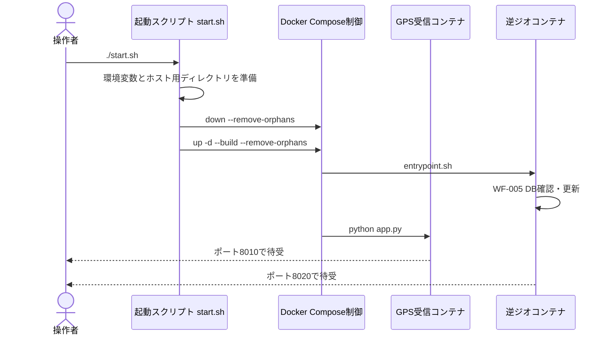
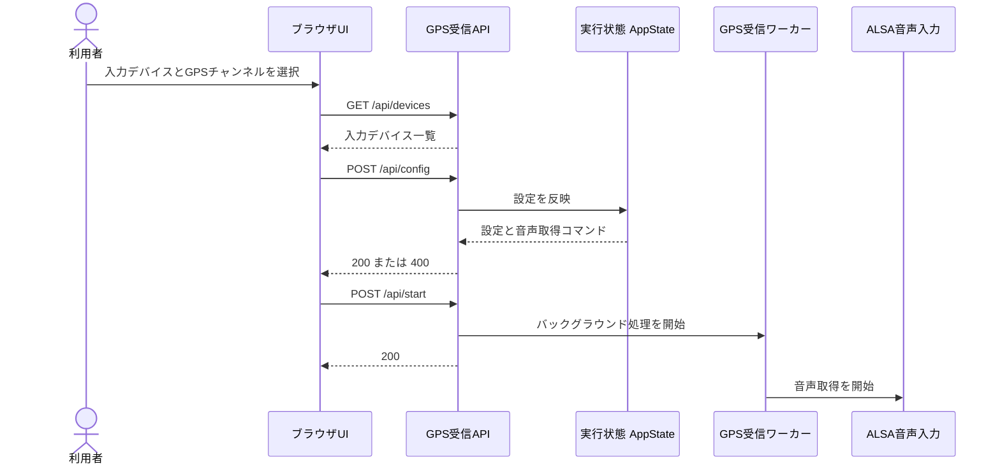
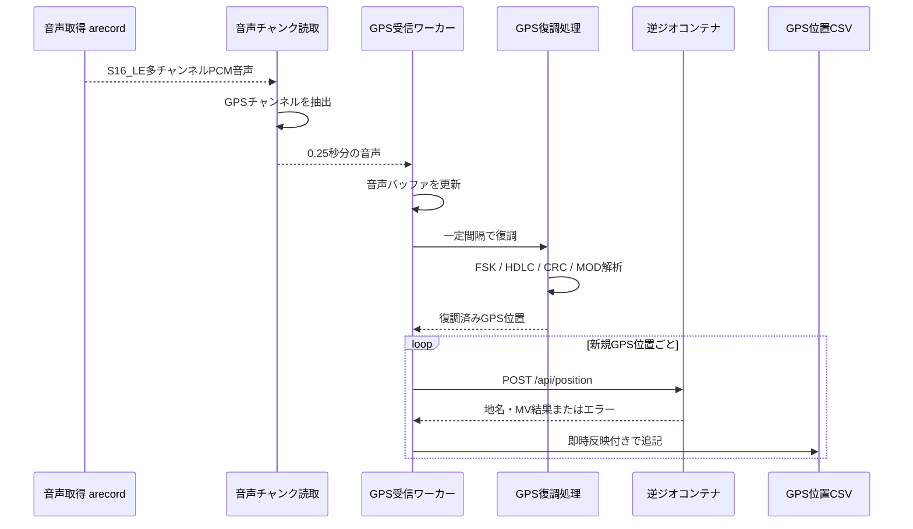
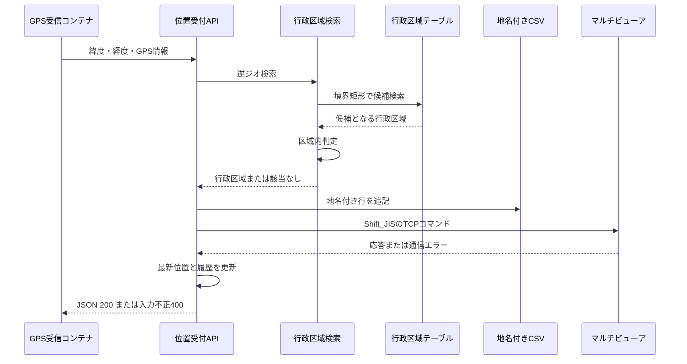
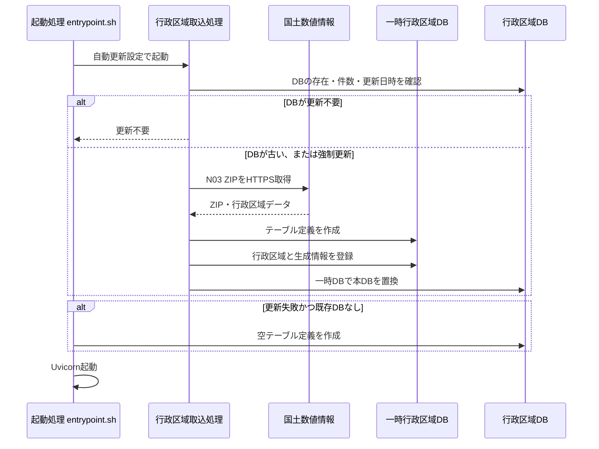
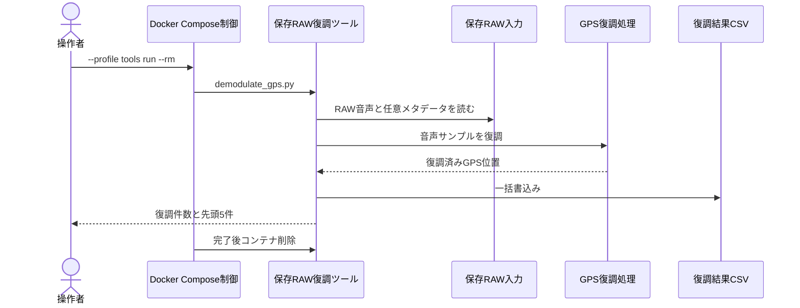
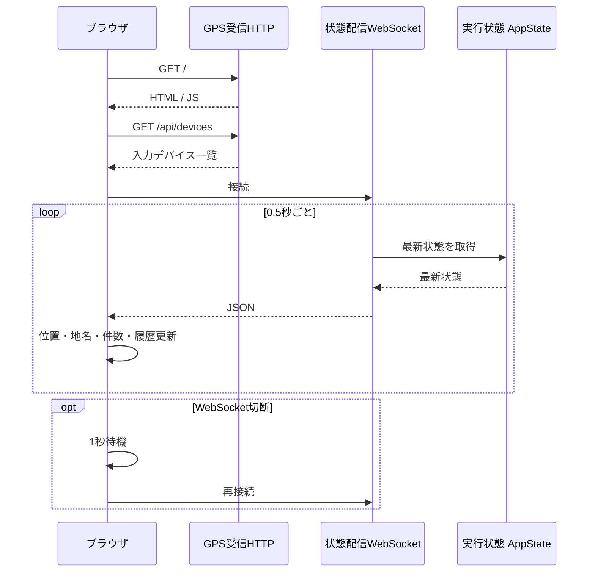
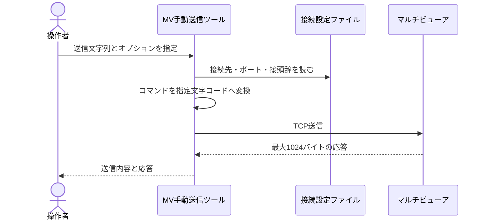

# ワークフロー

## 一覧

| ID | 名称 | 主なコンテナ |
|---|---|---|
| `WF-001` | Compose全体の再作成・起動 | 全体 |
| `WF-002` | UIからGPSリアルタイム取得開始 | `get-heri-gps` |
| `WF-003` | GPS音声の復調とCSV保存 | `get-heri-gps` |
| `WF-004` | 逆ジオ・地名CSV・MV送信 | `reverse-geocoder` |
| `WF-005` | 行政区域DBの取得・再構築 | `reverse-geocoder` |
| `WF-006` | 保存済みRAWの単発復調 | `gps-demodulator` |
| `WF-007` | UIのリアルタイム状態表示 | `get-heri-gps` |
| `WF-008` | MVへの手動コマンド送信 | Compose外CLI |

## WF-001 Compose全体の再作成・起動



起動scriptが既存コンテナを削除してから2つの通常serviceを再作成します。逆ジオはAPI起動前にDB確認・更新を行います。


### 入力

- ルート `.env`
- `gps_receiver/.env`
- `reverse_geocoder/.env`
- `docker-compose.yml`

### 処理の流れ

1. `start.sh` が不足する `.env` をexampleから作る。
2. output/data/logディレクトリを作る。
3. `docker compose down --remove-orphans` で既存コンテナを削除する。
4. `docker compose up -d --build --remove-orphans` で再作成する。
5. `reverse-geocoder` はentrypointでWF-005を行う。
6. `get-heri-gps` は `python app.py` でFastAPIを起動する。

### 出力

- `get_heri_gps` コンテナ
- `reverse_geocoder` コンテナ
- Compose network `get_heri_gps_default`

### 関連コンテナ

`get-heri-gps`、`reverse-geocoder`

### 関連API

起動後に全HTTP/WebSocket APIが利用可能になります。

### DB操作

WF-005によりDB確認・再構築が行われます。

### エラー時

- Docker/Composeがない場合は `start.sh` が終了する。
- `set -euo pipefail` によりCompose失敗時は起動スクリプトも失敗する。
- 逆ジオDBの更新失敗はentrypoint内で捕捉され、既存DBがあれば起動継続する。

## WF-002 UIからGPSリアルタイム取得開始



設定APIで実行時構成を確定し、開始APIがdaemon workerを起動します。worker開始後の入力エラーは、状態APIまたはWebSocketへ反映されます。


### 入力

- ALSA入力デバイス
- GPS音声チャンネル
- 入力チャンネル数
- CSV保存先、逆ジオURL

### 処理の流れ

1. UIが `GET /api/devices` で候補を取得する。
2. ユーザーがdeviceとGPS channelを選ぶ。
3. UIが `POST /api/config` へ設定を送る。
4. `AppState.set_config()` が型変換し、`arecord` コマンドを生成する。
5. UIが `POST /api/start` を呼ぶ。
6. daemon worker threadで `worker_main()` が開始する。

### 出力

- worker状態 `running`
- ALSAキャプチャプロセス

### 関連コンテナ

`get-heri-gps`

### 関連API

- `GET /api/devices`
- `POST /api/config`
- `POST /api/start`
- `POST /api/stop`

### DB操作

なし。

### エラー時

- UI側でdevice未選択なら開始要求を出さない。
- worker実行中に設定差分があると400を返す。
- `arecord` 起動・読取例外はworkerを `error` 状態にする。
- `POST /api/start` 自体はthread起動後すぐ200を返すため、後続worker失敗は状態API/WSで確認する。

## WF-003 GPS音声の復調とCSV保存



音声chunkをrolling bufferへ蓄積し、一定間隔で共通decoderへ渡します。CRCや形式検証を通った新規fixだけが逆ジオへ送られ、GPS CSVへ追記されます。


### 入力

- S16_LE、48kHz、interleaved PCM
- 選択GPSチャンネル

### 処理の流れ

1. `iter_command_chunks()` が `arecord` stdoutを0.25秒分ずつ読む。
2. NumPyでframe x channelへreshapeし、指定channelを抽出する。
3. `worker_main()` がrolling bufferへ追加する。
4. 一定間隔で `decode_samples()` を呼ぶ。
5. Goertzelで1200Hz/1800Hzを比較する。
6. differential decode + invertを行う。
7. HDLC flag分割、bit unstuff、LSB byte変換を行う。
8. control `0x03`、PID `0xF0`、CRC-16/X.25 residue `0xF0B8` を検証する。
9. `:MOD` payloadをBCD/DMSとして解析する。
10. `(offset_sec, payload_hex)` でworker内重複を除外する。
11. WF-004を同期呼出しする。
12. `gps_positions.csv` へflush付き追記を行う。

### 出力

```text
time,source,channel,offset_sec,lon,lat,alt,group,aircraft,payload_hex
```

### 関連コンテナ

`get-heri-gps`

### 関連API

- `POST /api/start`
- `GET /api/status`
- `GET /api/download`
- `WS /ws`

### DB操作

なし。結果はCSVです。

### エラー時

- 復調候補がない場合は次のintervalへ進む。
- CRC/format不一致frameは破棄する。
- 逆ジオ失敗でもGPS CSV保存は継続する。
- worker例外はログへstack traceを出し、状態を `error` にする。

## WF-004 逆ジオ・地名CSV・MV送信



位置APIはDB検索後、地名の有無にかかわらずCSVへ記録し、設定に従ってMV送信を試みます。MVの失敗はレスポンスbodyへ格納され、HTTP 200自体は維持されます。


### 入力

`POST /api/position` JSON。`lat`、`lon` 必須。

### 処理の流れ

1. handlerが `lat`、`lon` をfloatへ変換する。
2. `AdminGeocoder.reverse()` がbbox条件で `areas` をSELECTする。
3. 候補の `geometry_json` をpoint-in-polygon判定する。
4. 変換結果を `geocoded_positions.csv` へ追記する。
5. `render_text()` がMV文字列を作る。
6. `send_text()` がprefix + text + CRLFをShift_JIS化しTCP送信する。
7. APIレスポンスを `latest` と `history` に保存する。

### 出力

- 地名付きAPI response
- `geocoded_positions.csv`
- MV TCP command
- メモリ上の最新1件と直近100件

### 関連コンテナ

`reverse-geocoder`

### 関連API

- `POST /api/position`
- `GET /api/latest`
- `GET /api/history`

### DB操作

```sql
SELECT * FROM areas
WHERE min_lat <= :lat
  AND max_lat >= :lat
  AND min_lon <= :lon
  AND max_lon >= :lon;
```

DB書込みはありません。

### エラー時

- `lat/lon` 不正は400。
- 地名なしはHTTP 200、`ok:false`。空の地名列もCSVへ保存する。
- MV無効・空文字・重複は `skipped:true`。
- MV TCP例外はHTTP 200のまま `multiviewer.error` へ格納する。
- CSV/DBの未捕捉例外は500になり得る。

## WF-005 行政区域DBの取得・再構築



DBが新しければ再利用し、古い場合だけN03から一時DBを構築して置換します。更新失敗時は既存DBを優先し、DB自体がなければ空schemaでAPIを起動します。


### 入力

- `GEOCODER_DATA_URL`
- 既存DBのmtimeと件数
- `GEOCODER_UPDATE_DAYS`
- `GEOCODER_FORCE_UPDATE`

### 処理の流れ

1. entrypointが `GEOCODER_AUTO_UPDATE` を確認する。
2. `db_is_fresh()` がDB存在、`areas` 件数、mtimeを確認する。
3. staleならN03 ZIPをHTTPS取得する。
4. ShapefileをUTF-8、次にCP932で読む。
5. `create_schema()` が一時DBで `areas` と `metadata` を再作成する。
6. N03属性・rings・bboxをINSERTする。
7. metadataをINSERTする。
8. 一時DBを本DBへatomic replaceする。

### 出力

- `/app/data/admin_area.sqlite`
- `/app/data/source/<N03 ZIP>`

### 関連コンテナ

`reverse-geocoder`

### 関連API

`GET /api/health` が件数を参照します。

### DB操作

- `DROP TABLE IF EXISTS areas`
- `DROP TABLE IF EXISTS metadata`
- `CREATE TABLE`、`CREATE INDEX`
- N03 rows INSERT
- metadata INSERT

### エラー時

- 更新失敗でも既存DBがあれば起動継続する。
- DBが存在しない場合は空schemaを作る。
- 空DBでは `areas` が0件のため逆ジオ結果は常にnot found。

## WF-006 保存済みRAWの単発復調



`tools` プロファイルの一時コンテナが保存済みRAWを読み、リアルタイム処理と同じdecoderでCSVを作ります。復調0件の場合はheaderのみのCSVを正常出力します。


### 入力

- `/app/input` のcapture directoryまたはsingle-channel raw
- `GPS_CHANNEL`
- `SAMPLE_RATE`

### 処理の流れ

1. `gps-demodulator` をtools profileで一時起動する。
2. `demodulate_gps.py` がdirectoryなら `ch{channel}.raw` と `metadata.json` を読む。
3. raw全体またはlimit秒分をNumPy配列化する。
4. WF-003と同じ `decode_samples()` で復調する。
5. 結果をCSVへ一括書込みする。
6. command完了後コンテナを削除する。

### 出力

`/app/output/demodulated_gps.csv`

### 関連コンテナ

`gps-demodulator`

### 関連API

なし。

### DB操作

なし。

### エラー時

- inputがなければ `FileNotFoundError` で非0終了する。
- 不正metadata/RAWは未捕捉例外で非0終了する。
- 復調0件でもheaderのみCSVを作る。

## WF-007 UIのリアルタイム状態表示



Browserは初期HTMLとdevice一覧をHTTPで取得し、継続状態はWebSocketで受け取ります。接続が閉じると、実装済みJSが1秒後に再接続します。


### 入力

`AppState.snapshot()`

### 処理の流れ

1. Browserが `/` からHTML/JSを取得する。
2. JSが `/api/devices` を取得する。
3. JSが `/ws` へ接続する。
4. Serverが0.5秒ごとにsnapshotを送る。
5. UIが最新位置、地名、MV結果、件数、履歴を更新する。

### 出力

ブラウザUI。

### 関連コンテナ

`get-heri-gps`

### 関連API

- `GET /`
- `GET /api/devices`
- `WS /ws`

### DB操作

なし。

### エラー時

- WebSocket close時はJSが1秒後に再接続する。
- device一覧取得失敗はUIへメッセージを表示する。

## WF-008 MVへの手動コマンド送信



このWFはCompose外のhost CLIからMultiviewerへ直接送信します。socket接続エラーは非0終了し、応答待ちtimeoutだけは `(no response)` と表示します。


### 入力

`send_multiviewer.py` のtext、host、port、prefix、encoding、timeout。

### 処理の流れ

1. 環境変数または `reverse_geocoder/.env` を読む。
2. prefix + text + CRLFを作る。`--raw` ならprefixを付けない。
3. 指定encodingでbyte化する。
4. TCP接続し送信する。
5. 最大1024 bytesのresponseを表示する。

### 出力

ターミナルの送信内容とMV応答。

### 関連コンテナ

なし。ホストCLIです。

### 関連API

なし。

### DB操作

なし。

### エラー時

接続拒否、経路なし等のsocket例外は未捕捉で非0終了します。応答待ちだけがtimeoutした場合は `(no response)` と表示します。
